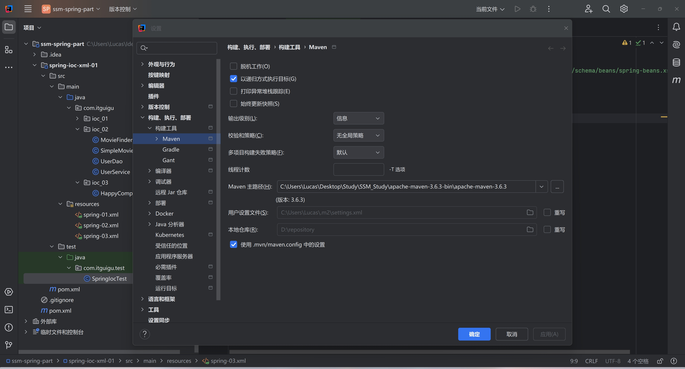
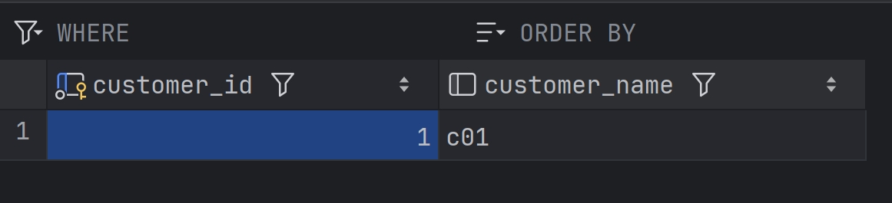
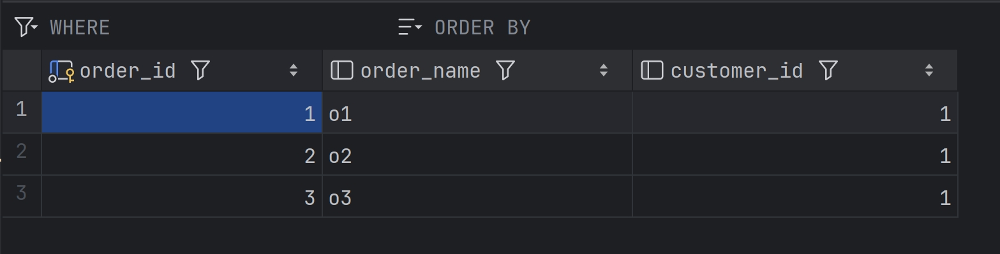
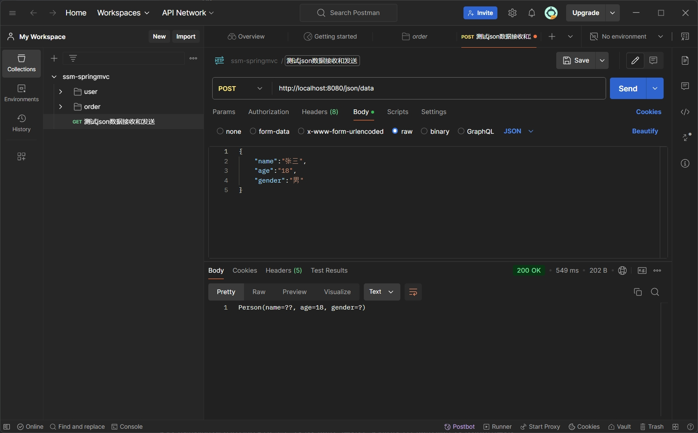

# SSM学习笔记

## Maven简单配置

Maven是专属于Java的包、依赖管理工具，通过xml进行配置，这里直接省略用法，后面Spring部分会多次用到

注意配置自己的Maven路径，虽然IDEA自带Maven包，但是我们可能会对Maven本地仓库和镜像等进行配置



## Bean编写

如下是一些类的配置方式

### 1.普通类

`<bean id="happyComponent" class="com.itguigu.ioc_01.HappyComponent"></bean>`配置的是`HappyComponent`这样一个无参类，`id`是他的唯一标识符，以后的引用或者调用都是它，`class`是组件的全限定符，是这个类的位置

### 2.静态工厂类

`<bean class="com.itguigu.ioc_01.ClientService" factory-method="createInstance" id="clientService"></bean>`是静态工厂类的配置方式，这里解释一下**工厂模式** 

- 工厂模式将对象的**具体创建过程**封装在工厂类中，而**用户只通过工厂接口来请求对象**，不需要了解如何创建这些对象

所以简单来说就是接口的封装，用户不能自己new出对应的类，只能通过预先设定好的接口函数去操作

`factory-method="createInstance"`限定这个类是静态工厂类

### 3.非静态工厂类

```xml
<!--    3.非静态工厂如何声明ioc配置-->
    <!--    3.1配置工厂类的组件-->
    <bean id="DefaultServiceLocator" class="com.itguigu.ioc_01.DefaultServiceLocator"></bean>
    <!--    3.2通过制定非静态工厂对象和方法名 来配置生成的ioc信息-->
    <bean id="clientService2" factory-bean="DefaultServiceLocator" factory-method="createClientServiceInstance"></bean>
```

### 4.有参构造类

已知`userDao`是自定义的数据类型，因此需要声明配置，而`userService`类在构造函数传入了自定义的`userDao`，因此，使用`constructor-arg`定义传参变量

```xml
    <bean id="userDao" class="com.itguigu.ioc_02.UserDao"></bean>

    <bean id="userService" class="com.itguigu.ioc_02.UserService">
        <!--        构造参数传值di的配置
        constructor-arg g构造参数传值的di配置
        value 直接属性值 String name = "你好"
        ref 引用其他的bean的id值-->
        <constructor-arg ref="userDao"></constructor-arg>
    </bean>
```

### 5.多个参数注入

已知`UserService`类拥有`userDao`、`age`、`name`三个变量，通过有参构造给变量赋值

```java
public class UserService {
    private UserDao userDao;
    private int age;
    private String name;

    public UserService(int age , String name ,UserDao userDao) {
        this.userDao = userDao;
        this.age = age;
        this.name = name;
    }
}
```

此时的Bean有三种写法

#### 方案一：构造参数的顺序填写

这种方法要求严格按照传参顺序编写，`value`是传入的默认值，如果传入的是对象类，则用`ref`写出对象的id

```xml
    <bean id="userServicel" class="com.itguigu.ioc_02.UserService">
        <!--       方案一：构造参数的顺序填写-->
        <constructor-arg value="18"></constructor-arg>
        <constructor-arg value="二狗子"></constructor-arg>
        <constructor-arg ref="userDao"></constructor-arg>
    </bean>
```

#### 方案二：构造参数的名字填写  推荐！

`name`就是传参的变量名，这样可以随意更换`constructor-arg`的顺序

```xml
    <bean id="userServicel" class="com.itguigu.ioc_02.UserService">
        <!--       方案二：构造参数的名字填写  推荐！-->
        <constructor-arg name="name" value="二狗子"></constructor-arg>
        <constructor-arg name="age" value="18"></constructor-arg>
        <constructor-arg ref="userDao"></constructor-arg>
    </bean>
```

#### 方案三：构造参数的下角标指定填写，不用考虑index

根据变量下标，index从0开始，不如第二种方法，因为你还得记住变量的顺序

```xml
    <bean id="userServicel" class="com.itguigu.ioc_02.UserService">
        <!--       方案三：构造参数的下角标指定填写，不用考虑index-->
        <constructor-arg index="1" value="二狗子"></constructor-arg>
        <constructor-arg index="0" value="18"></constructor-arg>
        <constructor-arg index="2" ref="userDao"></constructor-arg>
    </bean>
```

### 6.触发setter方法进行注入

单独声明`MovieFinder`类

```java
public class MovieFinder {
}
```

在`SimpleMovieLister`类中定义两个`setter`方法，专门用于更改数据

```java
public class SimpleMovieLister {
    private MovieFinder movieFinder;
    private String movieName;

    public void setMovieFinder(MovieFinder movieFinder) {
        this.movieFinder = movieFinder;
    }

    public void setMovieName(String movieName) {
        this.movieName = movieName;
    }

    // business logic that actually uses the injected MovieFinder is omitted...
}
```

对于`setter`函数我们有专门的Bean配置方式

先声明`MovieFinder`类，然后使用`property`标签定义变量，`name`属性名就是setter方法的去掉set和首字母小写的名，比如你的函数名叫`setMovieFinder`，那么name就可以写成`movieFinder`

```xml
    <bean id="MovieFinder" class="com.itguigu.ioc_02.MovieFinder"></bean>

    <bean id="SimpleMovieLister" class="com.itguigu.ioc_02.SimpleMovieLister">
        <!--        name 属性名 setter方法的去掉set和首字母小写的名 setMovieFinder -> movieFinder
        value | ref 二选一 value="直接属性值“ ref="其他bean的id"-->
        <property name="movieName" value="消失的她"></property>
        <property name="movieFinder" ref="MovieFinder"></property>
    </bean>
```

## 获取ioc管理的类

如图创建`HappyComponent`类，里面有一个自定义函数`dowork`

```java
public class HappyComponent {

    //默认包含无参数构造函数

    public void doWork() {

        System.out.println("HappyComponent.doWork");
    }
}
```

简单配置Bean

```xml
<bean id="happyComponent" class="com.itguigu.ioc_03.HappyComponent"></bean>
```

### 创建ioc容器并且读取配置文件

#### 方式1：直接创建容器，并且指定配置文件

通过构造函数，完成ioc对象的声明，配置文件的指定到刷新

```java
 ApplicationContext context = new ClassPathXmlApplicationContext("spring-03.xml");
```

#### 方式2：先创建ioc对象，再指定配置文件，再刷新

顾名思义，`new`出`ClassPathXmlApplicationContext`对象，通过`setConfigLocation`指定配置文件，`refresh`手动刷新

```java
 ClassPathXmlApplicationContext applicationContext = new ClassPathXmlApplicationContext();
 applicationContext.setConfigLocation("spring-03.xml");
 applicationContext.refresh();
```

一般如果不会更换配置文件，通常使用第一种方法

### 获取组件

#### 方案一：直接根据bean id获取,返回值类型是Object,需要强制转化类型

默认返回的`happyComponent`变量是`Object`，需要强制转换类型

```java
HappyComponent happyComponent = (HappyComponent) applicationContext.getBean("happyComponent");
```

#### 方案二：跟据beanId，同时指出bean的类型class,推荐

`getBean`方法里面跟上组件的类型，无需强转类型

```java
HappyComponent happyComponent1 = applicationContext.getBean("happyComponent", HappyComponent.class);
```

#### 方案三：直接根据类型获取,同一个类型在ioc容器中只能有一个bean！！！不推荐

如果ioc容器存在多个bean会出现异常

```java
HappyComponent happyComponent2 = applicationContext.getBean(HappyComponent.class);
```

### 高级特性：组件作用域和周期的配置

一个组件的周期通常包括`init`(创建),服务，`destroy`(销毁)；我们可以在Bean中配置相应的`init`和`destroy`回调函数

以下是`JavaBean`类的`init`和`destroy`方法

```java
public class JavaBean {
    // 必须是void和public以及无参数
    public void init() {
        System.out.println("JavaBean init");
    }

    // 销毁方法
    public void destroy() {
        System.out.println("JavaBean destroy");
    }
}
```

在XML文件中使用`init-method`和`destroy-method`去配置，组件将会自动在相应生命周期调用相应的回调函数

```xml
 <!--    通过init-method声明初始化变量名 通过destroy-method声明销毁方法变量名-->
    <bean id="JavaBean" class="com.itguigu.ioc_04.JavaBean" init-method="init" destroy-method="destroy"></bean>
```

### **FactoryBean**的特性和使用

在一些复杂的项目中，类的创建和配置是很复杂的，我们不想将类的创建和配置与逻辑代码混在一起，这不方便后期的维护和管理，因此我们会将类的创建和配置统一封装并交给`FactoryBean`，让程序员不必关注创建的复杂过程，可以直接获取对象并调用它的方法

以下是`JavaBean`类

```java
public class JavaBean {
    private String name;

    public String getName() {
        return name;
    }

    public void setName(String name) {
        this.name = name;
    }

    @Override
    public String toString() {
        return "JavaBean{" +
                "name='" + name + '\'' +
                '}';
    }
}
```

我们将`JavaBean`的创建交给`JavaBeanFactoryBean`，并且需要重写`getObject`和`getObjectType`函数

```java
public class JavaBeanFactoryBean implements FactoryBean<JavaBean> {
    @Override
    public JavaBean getObject() throws Exception {
        // 使用自己的方式实例化对象
        JavaBean javaBean = new JavaBean();
        javaBean.setName(value);
        return javaBean;
    }

    @Override
    public Class<?> getObjectType() {
        return JavaBean.class;
    }
}
```

xml文件的配置

```xml
 <bean id="javaBean" class="com.itguigu.ioc_05.JavaBeanFactoryBean"></bean>
```

进行代码的测试

```java
 @Test
    public void test_05(){
        ClassPathXmlApplicationContext applicationContext = new ClassPathXmlApplicationContext("spring-05.xml");

       // 读取组件
        JavaBean javaBean = applicationContext.getBean("javaBean", JavaBean.class);
        System.out.println(javaBean);
    }
```

但是`JavaBean`类存在私有成员变量`name`我们该如何传参呢？

你可能会写出以下代码

```xml
    <bean id="javaBean" class="com.itguigu.ioc_05.JavaBeanFactoryBean">
        <!--        此位置的属性是给JavaBean工厂配置的，而不是getObject-->
        <property name="value" value="Lucas"></property>
    </bean>
```

显然我们配置的是`JavaBeanFactoryBean`类，你这样写参数只会给`JavaBeanFactoryBean`，而不是`JavaBean`，因此我们可以对`JavaBeanFactoryBean`稍做配置

给那个类自定义私有成员变量`value`，并且接收外部传参，也就是我们配置的`property`

在`getObject`函数中` javaBean.setName(value);`从而实现`javaBean`类参数的注入

```java
public class JavaBeanFactoryBean implements FactoryBean<JavaBean> {
    private String value;

    public void setValue(String value) {
        this.value = value;
    }

    @Override
    public JavaBean getObject() throws Exception {
        // 使用自己的方式实例化对象
        JavaBean javaBean = new JavaBean();
        javaBean.setName(value);
        return javaBean;
    }

    @Override
    public Class<?> getObjectType() {
        return JavaBean.class;
    }
}
```

运行结果

`JavaBean{name='Lucas'}`

### 基于XMl方式整合三层架构

#### 需求分析

搭建一个三层架构案例，模拟查询全部学生（学生表）信息，持久层使用JdbcTemplate和Druid技术，使用XML方式进行组件管理！

#### 结构图


在一个后端中我们通常将业务分成三层架构，分别是**控制层**，**业务层**，**DAO层**

##### DAO层

DAO的全称是**DataBase Access Object** 数据库访问对象，主要负责连接数据库，完成数据库的增删改查业务

##### 业务层（Service）

业务层负责处理DAO层传递过来的原始数据，对数据进行深加工

##### 控制层（Controller）

控制层负责通过网络与前端进行交流，传递业务层加工过的数据

---

下面我将举一个例子方便理解这三个业务层的关系

假设数据库里面存储着一个人的工资表，其中包括基础工资、绩效、补贴等信息，DAO层负责从数据库里面原封不动的取出这些数据，并把他们丢给业务层，业务层负责处理这些未加工的数据，比如计算工资总额，进行扣税、缴纳社保等操作，并将结果交给控制层，控制层负责与前端沟通，如果前端需要工资总额的数据，就将业务层处理过的数据交给前端展示

理清楚这些关系后我们回到业务上面，假设我们的目的是获取全部学生数据，分别进行三层架构的编写

#### DAO层代码

1.编写`StudentDao`接口，对外暴露获取DAO层数据的方法

```java
public interface StudentDao {
    List<Student> queryAll();
}
```

2.编写`StudentDao`的具体实现方法,类命名为`StudentDaoImpl`，继承自`StudentDao`

由于我们DAO层是通过`jdbcTemplate`的方法进行注入，需要构造他的`Setter`方法

并且我们需要重写`queryAll`方法

特别说明这两行代码

```java
String sql = "select id, name, age, class as classes from students";
List<Student> students = jdbcTemplate.query(sql, new BeanPropertyRowMapper<Student>(Student.class));
```

由于class是java 的关键字，因此数据库的字段名取别名为classes

通过BeanPropertyRowMapper帮助我们自动映射列和属性值，我们不需要根据字段名取出对应数据

```java
public class StudentDaoImpl implements StudentDao {

    // 注入jdbcTemplate对象
    public void setJdbcTemplate(JdbcTemplate jdbcTemplate) {
        this.jdbcTemplate = jdbcTemplate;
    }

    private JdbcTemplate jdbcTemplate;

    @Override
    public List<Student> queryAll() {
        String sql = "select id, name, age, class as classes from students";
        List<Student> students = jdbcTemplate.query(sql, new BeanPropertyRowMapper<Student>(Student.class));
        System.out.println(students);
        return students;
    }
}
```

#### Service层代码

1.编写`StudentService`接口，负责将获取业务层数据的方法对外暴露出去

```java
public interface StudentService {
    List<Student> findAll();
}
```

2.实现接口的具体方法类

我们也需要提供`StudentDao`的`Setter`方法，并且重写`findAll`函数，调用DAO层的`queryAll`方法

```java
public class StudentServiceImpl implements StudentService {
    private StudentDao studentDao;

    public void setStudentDao(StudentDao studentDao) {
        this.studentDao = studentDao;
    }

    @Override
    public List<Student> findAll() {
        List<Student> students = studentDao.queryAll();
        System.out.println("studentService:" + students);
        return students;
    }
}
```

#### Controller层代码

1.由于控制层只负责网络数据传输，因此他不需要接口

也需要提供`StudentService`的`Setter`方法

```java
public class StudentController {
    public void setStudentService(StudentService studentService) {
        this.studentService = studentService;
    }

    private StudentService studentService;

    public void findAll(){
        List<Student> all = studentService.findAll();
        System.out.println("最终学员数据为：" + all);
    }
}
```

#### XML编写

我们通常会将数据库的用户名、密码、URL、驱动信息单独写成`jdbc.properties`配置文件

```
itguigu.url=jdbc:mysql://localhost:3306/studb
itguigu.driver=com.mysql.cj.jdbc.Driver
itguigu.username=root
itguigu.password=123456
```

使用`<context:property-placeholder location="classpath:jdbc.properties" />`引入配置文件

```xml
<context:property-placeholder location="classpath:jdbc.properties" />
<!--    配置druid-->
<bean id="dataSource" class="com.alibaba.druid.pool.DruidDataSource">
    <property name="url" value="${itguigu.url}"></property>
    <property name="username" value="${itguigu.username}"></property>
    <property name="password" value="${itguigu.password}"></property>
    <property name="driverClassName" value="${itguigu.driver}"></property>
</bean>

<!--    jdbcTemplate-->
<bean id="jdbcTemplate" class="org.springframework.jdbc.core.JdbcTemplate">
    <property name="dataSource" ref="dataSource"></property>
</bean>
<!--    dao配置 di jdbcTemplate-->
<bean id="studentDao" class="com.itguigu.dao.impl.StudentDaoImpl">
    <property name="jdbcTemplate" ref="jdbcTemplate"></property>
</bean>
<!--    service配置di dao-->
<bean id="studentService" class="com.itguigu.service.impl.StudentServiceImpl">
    <property name="studentDao" ref="studentDao"></property>
</bean>
<!--    controller配置di service-->
<bean id="studentController" class="com.itguigu.contoller.StudentController">
    <property name="studentService" ref="studentService"></property>
</bean>
```

## 注解方式管理bean

在以前，我们都是通过配置xml文件的方式管理bean，这是很麻烦的，我们可以通过注解的方式进行bean配置

### 普通组件

普通组件采用`@Component`标识符，他的id是类名首写字母小写，class是类组件自动配置

如果要单独指定组件的id名，可以采用`@Component(value="你的名字")`或者`@Component("你的名字")`这种方式自定义

```java
@Component  //<bean id="commonComponent" class=类组件>

/**
 * 1.标记注解
 * 2.配置指定包
 */
public class CommonComponent {

}
```

### DAO组件

DAO组件使用`@Repository`标识符

```java
@Repository
public class XxxDao {
}
```

### Service组件

Service组件使用`@Service`标识符

```java
@Service
public class XxxService {
}
```

### Controller组件

Controller组件使用`@Controller`标识符

```java
@Controller
public class XxxController {
}
```

### XML配置

当然我们还是需要对xml文件进行简单的配置

base-package是进行bean管理的位置，如果是整个软件包，他会对里面所有做了注解的组件统一进行管理

```xml
   <!--    1.普通配置包扫描
            指定ioc容器去哪找注解类
    -->
    <context:component-scan base-package="com.itguigu.ioc_01"/>

    <!--    2.指定包但是排除注解-->
    <context:component-scan base-package="com.itguigu">
        <context:exclude-filter type="annotation" expression="org.springframework.stereotype.Repository"/>
    </context:component-scan>

    <!--    3.指定包含注解
    base-package指定包下所有的注解都生效！
    use-default-filters="false"指定包的所有注解都不生效-->
    <context:component-scan base-package="com.itguigu" use-default-filters="false">
        <!--        只扫描次包下的注解-->
        <context:include-filter type="annotation" expression="org.springframework.stereotype.Repository"/>
    </context:component-scan>
```

### 组件作用域和周期

使用注解同样也可以配置周期对应的回调函数

#### 组件初始化回调函数

```java
@PostConstruct
public void init(){
    System.out.println("init");
}
```

#### 组件销毁回调函数

```java
@PreDestroy
public void destroy(){
    System.out.println("destroy");
}
```

#### 单例和多例模式切换

```java
@Scope(scopeName = ConfigurableBeanFactory.SCOPE_SINGLETON)		单例模式，默认
@Scope(scopeName = ConfigurableBeanFactory.SCOPE_PROTOTYPE)		多例模式
@Component
public void JavaBean{}
```

### 引用类型自动装配

我们知道在xml配置bean的时候，每个类需要对应的setter方法进行注入，例如

声明接口

```java
public interface UserService {
    public String show();
}
```

实现方法

```java
@Service
public class UserServiceImpl implements UserService {
    @Override
    public String show() {
        return "UserServiceImpl show";
    }
}
```

Controller层

```java
@Controller
public class UserController {
    private UserService userService;
    
    public void setUserService(UserService userService){
        this.userService = userService;
    }

    public void show(){
        // 调用业务层的方法
        String show = userService.show();
        System.out.println(show);
    }
}
```

Test调用Controller

```java
    public void test03(){
        ClassPathXmlApplicationContext context = new ClassPathXmlApplicationContext("spring-03.xml");
        UserController userController = context.getBean(UserController.class);
        userController.show();
    }
```

但是通过注解的方式我们就不需要再编写setter方法

#### 使用`@Autowired`

```java
@Controller
public class UserController {
    @Autowired
    private UserService userService;

    public void show(){
        // 调用业务层的方法
        String show = userService.show();
        System.out.println(show);
    }
}
```

#### 使用`@Qualifier("")`自定义bean名称

虽然对于组件我们不用单独指定id，因为他的id默认是首字母的小写，但是一个接口可能会被多个类重写，如果我们不指定bean名称，DI就无法找到指定的组件

例如以下是一个接口

```java
public interface UserService {
    public String show();
}
```

下面两个类分别重写了show方法

```java
@Service
public class NewUserServiceImpl implements UserService {

    @Override
    public String show() {
        return "NewUserServiceImpl show";
    }
}
```

```java
@Service
public class UserServiceImpl implements UserService {

    @Override
    public String show() {
        return "UserServiceImpl show";
    }
}

```

如果我们只写一个`UserService userService`，就会报错

```java
@Controller
public class UserController {
    @Autowired
    private UserService userService;

    public void show(){
        // 调用业务层的方法
        String show = userService.show();
        System.out.println(show);
    }
}
```

修改办法，加上` @Qualifier("userServiceImpl")`这样就指定了组件

```java
@Controller
public class UserController {
    @Autowired
    @Qualifier("userServiceImpl")
    private UserService userService;

    public void show(){
        // 调用业务层的方法
        String show = userService.show();
        System.out.println(show);
    }
}
```

#### 使用`@Resource(name = "")`简化写法

当然我们也有简化写法，比如`@Resource(name = "userServiceImpl")`，但是`@Resource`是一个包里面的内容

```java
@Controller
public class UserController {
    @Resource(name = "userServiceImpl")
    private UserService userService;

    public void show(){
        // 调用业务层的方法
        String show = userService.show();
        System.out.println(show);
    }
}
```


```xml
<dependency>
    <groupId>jakarta.annotation</groupId>
    <artifactId>jakarta.annotation-api</artifactId>
    <version>3.0.0</version>
</dependency>
```

### bean属性赋值，基本属性赋值

#### 方案一：直接赋值

```java
 private String name = "Lucas";
```

#### 方案二：Value注解

```java
@Value("20")
private int age;
```

当然使用`@Value`注解一般是引入外部配置

例如`jdbc.properties`文件有以下信息

```properties
jdbc.password = 123456
```

Value注入可以写成

其中` @Value("${jdbc.username:admin}")`是指定默认值，为了防止配置文件里面没有值

```java
 @Value("${jdbc.username:admin}")
 private String userName;
 @Value("${jdbc.password:000000}")
 private String password;
```

### 使用注解的方式配置bean和DI，完成三层架构

由于在xml配置，完成三层架构的章节我们分析过这个案例，这里我就不再作说明，直接给出代码


#### Pojo层

```java
package com.itguigu.pojo;

public class Student {
    private Integer id;
    private String name;
    private String gender;
    private Integer age;
    private String classes;

    public Integer getId() {
        return id;
    }

    public void setId(Integer id) {
        this.id = id;
    }

    public String getName() {
        return name;
    }

    public void setName(String name) {
        this.name = name;
    }

    public String getGender() {
        return gender;
    }

    public void setGender(String gender) {
        this.gender = gender;
    }

    public Integer getAge() {
        return age;
    }

    public void setAge(Integer age) {
        this.age = age;
    }

    public String getClasses() {
        return classes;
    }

    public void setClasses(String classes) {
        this.classes = classes;
    }

    @Override
    public String toString() {
        return "Student{" +
                "id=" + id +
                ", name='" + name + '\'' +
                ", gender='" + gender + '\'' +
                ", age=" + age +
                ", classes='" + classes + '\'' +
                '}';
    }
}
```

#### Dao层

##### 接口

```java
public interface StudentDao {
    List<Student> queryAll();
}
```

##### 实现类

```java
@Repository
public class StudentDaoImpl implements StudentDao {
    @Autowired
    private JdbcTemplate jdbcTemplate;

    @Override
    public List<Student> queryAll() {
        String sql = "select * from students";
        List<Student> studentList = jdbcTemplate.query(sql, new BeanPropertyRowMapper<Student>(Student.class));
        System.out.println("dao: " + studentList);
        return studentList;
    }
}
```

#### Service层

##### 接口

```java
public interface StudentService {
    List<Student> findAll();
}
```

##### 实现类

```java
@Service
public class StudentServiceImpl implements StudentService {

    @Autowired
    private StudentDao studentDao;

    @Override
    public List<Student> findAll() {
        List<Student> studentList = studentDao.queryAll();
        System.out.println("service: " + studentList);
        return studentList;
    }
}
```

#### Controller层

```java
@Controller
public class StudentController {
    @Autowired
    private StudentService studentService;

    public void findAllStudents() {
        List<Student> studentList = studentService.findAll();
        System.out.println("controller: " + studentList);
    }
}
```

#### Test测试类

```java
public class SpringIocTest {
    @Test
    public void test() {
        ClassPathXmlApplicationContext context = new ClassPathXmlApplicationContext("spring-01.xml");
        StudentController studentController = context.getBean(StudentController.class);
        studentController.findAllStudents();

    }
}
```

#### 配置xml

在这里`DruidDataSource`和`JdbcTemplate`都是New出来的，只能采取xml配置bean

```xml
<?xml version="1.0" encoding="UTF-8"?>
<beans xmlns="http://www.springframework.org/schema/beans"
       xmlns:xsi="http://www.w3.org/2001/XMLSchema-instance"
       xmlns:context="http://www.springframework.org/schema/context"
       xsi:schemaLocation="http://www.springframework.org/schema/beans http://www.springframework.org/schema/beans/spring-beans.xsd http://www.springframework.org/schema/context https://www.springframework.org/schema/context/spring-context.xsd">

    <context:component-scan base-package="com.itguigu"></context:component-scan>
    <context:property-placeholder location="jdbc.properties"></context:property-placeholder>

    <bean id="dataSource" class="com.alibaba.druid.pool.DruidDataSource">
        <property name="driverClassName" value="${itguigu.driver}"></property>
        <property name="username" value="${itguigu.username}"></property>
        <property name="password" value="${itguigu.password}"></property>
        <property name="url" value="${itguigu.url}"></property>
    </bean>
    <bean id="jdbcTemplate" class="org.springframework.jdbc.core.JdbcTemplate">
        <property name="dataSource" ref="dataSource"></property>
    </bean>
</beans>
```

#### 配置文件

```properties
itguigu.url=jdbc:mysql://localhost:3306/studb
itguigu.driver=com.mysql.cj.jdbc.Driver
itguigu.username=root
itguigu.password=123456
```

## 基于配置类管理Bean

在之前的项目中，我们是采取注解+xml'的方式配置的管理DI，在未来的项目中，我们更多采用的方式是抛弃xml方式配置，转而采取配置类方式管理和配置Bean

### 配置类+注解

例如我们有一个配置类`JavaConfiguration`，专门用于配置类

| 配置类                                                 | XML                                                          |
| ------------------------------------------------------ | ------------------------------------------------------------ |
| `@ComponentScan(value = "com.itguigu.ioc_01")`         | `<context:component-scan base-package="com.itguigu.ioc_01"></context:component-scan>` |
| `@PropertySource(value = "classpath:jdbc.properties")` | `<context:property-placeholder location="jdbc.properties"></context:property-placeholder`> |
| `@Configuration`                                       | 无                                                           |

```java
@Configuration
@PropertySource(value = "classpath:jdbc.properties")
@ComponentScan(value = "com.itguigu.ioc_01")
public class JavaConfiguration {
    
}
```

例如，我们需要使用`Druid`连接池，就有以下写法

`@Value`注解在这里就可以引用外部配置文件

函数名默认就是Bean的id值，可以在函数里面实现具体的方法

凡是在配置类里面的方法都必须使用`@Bean`注解

`@Bean(value = "Lucas", initMethod = "", destroyMethod = "")`,其中`value`是Bean的别名，`initMethod`是初始化回调函数名，`destroyMethod`是销毁回调函数名

```java
@Configuration
@PropertySource(value = "classpath:jdbc.properties")
@ComponentScan(value = "com.itguigu.ioc_01")
public class JavaConfiguration {
    @Value("${itguigu.url}")
    private String url;
    @Value("${itguigu.username}")
    private String username;
    @Value("${itguigu.password}")
    private String password;
    @Value("${itguigu.driver}")
    private String driverClassName;
    
    @Bean(value = "Lucas", initMethod = "", destroyMethod = "")
    public DruidDataSource dataSource() {
        // 实现具体的实例化过程
        DruidDataSource dataSource = new DruidDataSource();
        dataSource.setDriverClassName(driverClassName);
        dataSource.setUrl(url);
        dataSource.setUsername(username);
        dataSource.setPassword(password);
        return dataSource;
    }
}
```

如需在配置类里面引用其他类的方法，比如`JdbcTemplate`需要引用`DruidDataSource`类

只需要直接调用就可以了

```java
@Bean
public JdbcTemplate getJdbcTemplate() {
    JdbcTemplate jdbcTemplate = new JdbcTemplate();
    // 需要ioc里面的其他组件
    // 方案一：如果其他组件也是@Bean方法，可以直接调用 | 从ioc容器获取组件
    jdbcTemplate.setDataSource(dataSource1());
    return jdbcTemplate;
}
```

也有别的写法，直接将参数传进去

```java
@Bean
// Lucas是取的别名
public JdbcTemplate getJdbcTemplate1(DataSource Lucas) {
    JdbcTemplate jdbcTemplate = new JdbcTemplate();
    // 需要ioc里面的其他组件
    // 方案二：形参列表声明的想要的组件类型，可以是一个，也可以是多个！ioc容器也会注入
    // 形参变量注入，要求必须有对应的类型和组件，如果没有抛异常
    // 如果有多个，可以写形参名称等同于对应bean标识即可
    jdbcTemplate.setDataSource(Lucas);
    return jdbcTemplate;
}
```

### 创建ioc容器

```java
ApplicationContext applicationContext = new AnnotationConfigApplicationContext(配置类);
```

当然如果拆开写

```java
AnnotationConfigApplicationContext annotationConfigApplicationContext = new AnnotationConfigApplicationContext();
annotationConfigApplicationContext.register(JavaConfiguration.class);
annotationConfigApplicationContext.refresh();
```

剩下的就一样了

### 使用配置类+注解的方式完成三层架构

由于大部分代码并没有区别，这里只展示配置类的代码

```java
@Configuration
@ComponentScan(basePackages = "com.itguigu")
@PropertySource(value = "classpath:jdbc.properties")
public class JavaConfig {
    @Value("${itguigu.driver}")
    private String driver;
    @Value("${itguigu.url}")
    private String url ;
    @Value("${itguigu.username}")
    private String username;
    @Value("${itguigu.password}")
    private String password;

    @Bean
    public DataSource dataSource() {
        DruidDataSource dataSource = new DruidDataSource();
        dataSource.setDriverClassName(driver);
        dataSource.setUrl(url);
        dataSource.setUsername(username);
        dataSource.setPassword(password);
        return dataSource;
    }

    @Bean
    public JdbcTemplate JdbcTemplate(DataSource dataSource) {
        JdbcTemplate jdbcTemplate = new JdbcTemplate();
        jdbcTemplate.setDataSource(dataSource);
        return jdbcTemplate;
    }
}
```

### @Import扩展

`@Import` 注释允许从另一个配置类加载 `@Bean` 定义，如以下示例所示：

```java
@Configuration
public class ConfigA {

  @Bean
  public A a() {
    return new A();
  }
}

@Configuration
@Import(ConfigA.class)
public class ConfigB {

  @Bean
  public B b() {
    return new B();
  }
}
```

现在，在实例化上下文时不需要同时指定 `ConfigA.class` 和 `ConfigB.class` ，只需显式提供 `ConfigB` ，如以下示例所示：

```java
public static void main(String[] args) {
  ApplicationContext ctx = new AnnotationConfigApplicationContext(ConfigB.class);

  // now both beans A and B will be available...
  A a = ctx.getBean(A.class);
  B b = ctx.getBean(B.class);
}
```

## Spring AOP面向切片编程

### 1.场景引入

简单实现计算接口

```java
public interface Calculator {

    int add(int i, int j);

    int sub(int i, int j);

    int mul(int i, int j);

    int div(int i, int j);
}
```

具体实现

```java
public class CalculatorPureImpl implements Calculator {
    @Override
    public int add(int i, int j) {

        int result = i + j;
        return result;
    }

    @Override
    public int sub(int i, int j) {

        int result = i - j;
        return result;
    }

    @Override
    public int mul(int i, int j) {

        int result = i * j;
        return result;
    }

    @Override
    public int div(int i, int j) {

        int result = i / j;
        return result;
    }
}
```

我们希望在执行计算的时候，可以生成对应的日志，比如输出i和j的值，然后输出result值

```java
    @Override
    public int add(int i, int j) {
        System.out.println("i = " + i + ", j = " + j);
        int result = i + j;
        System.out.println("result = " + result);
        return result;
    }

    @Override
    public int sub(int i, int j) {
        System.out.println("i = " + i + ", j = " + j);
        int result = i - j;
        System.out.println("result = " + result);
        return result;
    }

    @Override
    public int mul(int i, int j) {
        System.out.println("i = " + i + ", j = " + j);
        int result = i * j;
        System.out.println("result = " + result);
        return result;
    }

    @Override
    public int div(int i, int j) {
        System.out.println("i = " + i + ", j = " + j);
        int result = i / j;
        System.out.println("result = " + result);
        return result;
    }
}
```

这是添加了输出日志的代码，可以发现，代码变得十分冗余，有大量的重复代码，如果以后有更多这样的方法，我们岂不是全部都要配置一次

这里就引出了代理的概念，它类似于中介，我们能不能通过代理去调用对应的方法，我们只需要在代理哪里去配置输出日志，从而不改动核心代码

#### 静态代理

```java
/**
 * 代理类
 */
public class StaticProxyCalculator implements Calculator {

    private Calculator calculator;

    // 使用构造方法传入目标
    public StaticProxyCalculator(Calculator target) {
        this.calculator = target;
    }

    @Override
    public int add(int i, int j) {
        // 非核心业务交给中介代理
        System.out.println("i = " + i + ", j = " + j);
        int result = calculator.add(i, j);
        System.out.println("result = " + result);
        return result;
    }

    @Override
    public int sub(int i, int j) {
        return 0;
    }

    @Override
    public int mul(int i, int j) {
        return 0;
    }

    @Override
    public int div(int i, int j) {
        return 0;
    }
}
```

输出类

```java
public static void main(String[] args) {
    Calculator target = new CalculatorPureImpl();
    // 中介对象
    Calculator proxy = new StaticProxyCalculator(target);
    int result = proxy.add(1, 2);
}
```

#### 动态代理

动态代理技术分类

- JDK动态代理：JDK原生的实现方式，需要被代理的目标类必须**实现接口**！他会根据目标类的接口动态生成一个代理对象！代理对象和目标对象有相同的接口！（拜把子）
- cglib：通过继承被代理的目标类实现代理，所以不需要目标类实现接口！（认干爹）

基于JDK代理

```java
// jdk动态代理
public class ProxyFactory {
    private Object target;

    public ProxyFactory(Object target) {
        this.target = target;
    }

    public Object getProxy() {

        /**
         * newProxyInstance()：创建一个代理实例
         * 其中有三个参数：
         * 1、classLoader：加载动态生成的代理类的类加载器
         * 2、interfaces：目标对象实现的所有接口的class对象所组成的数组
         * 3、invocationHandler：设置代理对象实现目标对象方法的过程，即代理类中如何重写接口中的抽象方法
         */
        ClassLoader classLoader = target.getClass().getClassLoader();
        Class<?>[] interfaces = target.getClass().getInterfaces();
        InvocationHandler invocationHandler = new InvocationHandler() {
            @Override
            public Object invoke(Object proxy, Method method, Object[] args) throws Throwable {
                /**
                 * proxy：代理对象
                 * method：代理对象需要实现的方法，即其中需要重写的方法
                 * args：method所对应方法的参数
                 */
                Object result = null;
                try {
                    System.out.println("[动态代理][日志] " + method.getName() + "，参数：" + Arrays.toString(args));
                    // 通过反射调用目标方法
                    result = method.invoke(target, args);
                    System.out.println("[动态代理][日志] " + method.getName() + "，结果：" + result);
                } catch (Exception e) {
                    e.printStackTrace();
                    System.out.println("[动态代理][日志] " + method.getName() + "，异常：" + e.getMessage());
                } finally {
                    System.out.println("[动态代理][日志] " + method.getName() + "，方法执行完毕");
                }
                return result;
            }
        };

        // 生成jdk代理对象
        // 参数一：类加载器
        // 参数二：目标类的接口
        // 参数三：具体要进行的代理动作
        return Proxy.newProxyInstance(classLoader, interfaces, invocationHandler);
    }
}
```

测试代码

```java
public static void main(String[] args) {
     // jdk代理
     ProxyFactory factory = new ProxyFactory(target);
     // 使用接口借值 = 代理对象[兄弟 拜把子]
     Calculator proxy1 = (Calculator) factory.getProxy();
     proxy1.add(1, 2);
}
```

### Spring AOP框架基于注解方式实现

在前面我们自己实现了静态代理和动态代理，但其实在工作中，我们都是使用spring内置的AOP框架完成代理

#### 导入对应的包

```xml
<!-- spring-aspects会帮我们传递过来aspectjweaver -->
<dependency>
    <groupId>org.springframework</groupId>
    <artifactId>spring-aop</artifactId>
    <version>6.0.6</version>
</dependency>

<dependency>
    <groupId>org.springframework</groupId>
    <artifactId>spring-aspects</artifactId>
    <version>6.0.6</version>
</dependency>
```

#### 准备接口

```java
public interface Calculator {
    
    int add(int i, int j);
    
    int sub(int i, int j);
    
    int mul(int i, int j);
    
    int div(int i, int j);
    
}
```

####  实现类

```java
package com.atguigu.proxy;
/**
 * 实现计算接口,单纯添加 + - * / 实现! 掺杂其他功能!
 */
@Component
public class CalculatorPureImpl implements Calculator {
    
    @Override
    public int add(int i, int j) {
    
        int result = i + j;
    
        return result;
    }
    
    @Override
    public int sub(int i, int j) {
    
        int result = i - j;
    
        return result;
    }
    
    @Override
    public int mul(int i, int j) {
    
        int result = i * j;
    
        return result;
    }
    
    @Override
    public int div(int i, int j) {
    
        int result = i / j;
    
        return result;
    }
}
```

#### 声明切片类

```java
package com.atguigu.advice;

import org.aspectj.lang.annotation.*;
import org.springframework.stereotype.Component;

// @Aspect表示这个类是一个切面类
@Aspect
// @Component注解保证这个切面类能够放入IOC容器
@Component
public class LogAspect {
        
    // @Before注解：声明当前方法是前置通知方法
    // value属性：指定切入点表达式，由切入点表达式控制当前通知方法要作用在哪一个目标方法上
    @Before(value = "execution(public int com.atguigu.proxy.CalculatorPureImpl.add(int,int))")
    public void printLogBeforeCore() {
        System.out.println("[AOP前置通知] 方法开始了");
    }
    
    @AfterReturning(value = "execution(public int com.atguigu.proxy.CalculatorPureImpl.add(int,int))")
    public void printLogAfterSuccess() {
        System.out.println("[AOP返回通知] 方法成功返回了");
    }
    
    @AfterThrowing(value = "execution(public int com.atguigu.proxy.CalculatorPureImpl.add(int,int))")
    public void printLogAfterException() {
        System.out.println("[AOP异常通知] 方法抛异常了");
    }
    
    @After(value = "execution(public int com.atguigu.proxy.CalculatorPureImpl.add(int,int))")
    public void printLogFinallyEnd() {
        System.out.println("[AOP后置通知] 方法最终结束了");
    }
    
}
```

#### 配置类

```java
@Configuration
@ComponentScan(value = "com.itguigu")
@EnableAspectJAutoProxy // 开启aspect注解 等同于<aop:aspectj-autoproxy></aop:aspectj-autoproxy>
public class JavaConfig {

}
```

#### 测试类

```java
//@SpringJUnitConfig(locations = "classpath:spring-aop.xml")
@SpringJUnitConfig(value = {MyConfig.class})
public class AopTest {

    @Autowired
    private Calculator calculator;

    @Test
    public void testCalculator(){
        calculator.add(1,1);
    }
}
```

#### 结果

```
[AOP前置通知] 方法开始了
[AOP返回通知] 方法成功返回了
[AOP后置通知] 方法最终结束了
```

### 获取通知细节

```java
// @Before注解标记前置通知方法
// value属性：切入点表达式，告诉Spring当前通知方法要套用到哪个目标方法上
// 在前置通知方法形参位置声明一个JoinPoint类型的参数，Spring就会将这个对象传入
// 根据JoinPoint对象就可以获取目标方法名称、实际参数列表
@Before(value = "execution(public int com.atguigu.aop.api.Calculator.add(int,int))")
public void printLogBeforeCore(JoinPoint joinPoint) {
    
    // 1.通过JoinPoint对象获取目标方法签名对象
    // 方法的签名：一个方法的全部声明信息
    Signature signature = joinPoint.getSignature();
    
    // 2.通过方法的签名对象获取目标方法的详细信息
    String methodName = signature.getName();
    System.out.println("methodName = " + methodName);
    
    int modifiers = signature.getModifiers();
    System.out.println("modifiers = " + modifiers);
    
    String declaringTypeName = signature.getDeclaringTypeName();
    System.out.println("declaringTypeName = " + declaringTypeName);
    
    // 3.通过JoinPoint对象获取外界调用目标方法时传入的实参列表
    Object[] args = joinPoint.getArgs();
    
    // 4.由于数组直接打印看不到具体数据，所以转换为List集合
    List<Object> argList = Arrays.asList(args);
    
    System.out.println("[AOP前置通知] " + methodName + "方法开始了，参数列表：" + argList);
}
```

### 方法返回值

在返回通知中，通过**@AfterReturning**注解的returning属性获取目标方法的返回值！

```Java
// @AfterReturning注解标记返回通知方法
// 在返回通知中获取目标方法返回值分两步：
// 第一步：在@AfterReturning注解中通过returning属性设置一个名称
// 第二步：使用returning属性设置的名称在通知方法中声明一个对应的形参
@AfterReturning(
        value = "execution(public int com.atguigu.aop.api.Calculator.add(int,int))",
        returning = "targetMethodReturnValue"
)
public void printLogAfterCoreSuccess(JoinPoint joinPoint, Object targetMethodReturnValue) {
    
    String methodName = joinPoint.getSignature().getName();
    
    System.out.println("[AOP返回通知] "+methodName+"方法成功结束了，返回值是：" + targetMethodReturnValue);
}
```

### 异常对象捕捉

在异常通知中，通过@AfterThrowing注解的throwing属性获取目标方法抛出的异常对象

```Java
// @AfterThrowing注解标记异常通知方法
// 在异常通知中获取目标方法抛出的异常分两步：
// 第一步：在@AfterThrowing注解中声明一个throwing属性设定形参名称
// 第二步：使用throwing属性指定的名称在通知方法声明形参，Spring会将目标方法抛出的异常对象从这里传给我们
@AfterThrowing(
        value = "execution(public int com.atguigu.aop.api.Calculator.add(int,int))",
        throwing = "targetMethodException"
)
public void printLogAfterCoreException(JoinPoint joinPoint, Throwable targetMethodException) {
    
    String methodName = joinPoint.getSignature().getName();
    
    System.out.println("[AOP异常通知] "+methodName+"方法抛异常了，异常类型是：" + targetMethodException.getClass().getName());
}
```

### 切点表达式语法


```
 /** 1.查询某包某类下，访问修饰符是公有，返回值是int的全部方法
     * public int xx.xx.jj.*(..)
     * 2.查询某包下类中第一个参数是String的方法
     *  * xx.xx.jj.*(String..)
     * 3.查询全部包下，无参数的方法！
     *  *.*..*.*()
     * 4.查询com包下，以int参数类型结尾的方法
     *  * com..*.*(..int)
     * 5.查询指定包下，Service开头类的私有返回值int的无参数方法
     *  private int xx.xx.Service*.*()
  */
```

### 重用切点表达式

在之前我们都是要写"com.xx.xx"这些复杂的切点表达式，如果类的位置或名字发生变化，我们都必须修改这些表达式，因此我们可以统一将切点表达式封装起来，便于复用

下面就是将切点表达式封装起来的类

```java
@Component
public class MyPointCut {

    @Pointcut("execution(* com.itguigu.service.impl.*.*(..))")
    public void pc() {

    }

    @Pointcut("execution(* com..impl.*.*(..))")
    public void myPc(){

    }

}
```

在别的位置引用

```java
@Component
@Aspect
public class TxAdvice {

    @Before("com.itguigu.pointcut.MyPointCut.pc()")
    public void begin(){
        System.out.println("begin");
    }

    @AfterReturning("com.itguigu.pointcut.MyPointCut.pc()")
    public void commit(){
        System.out.println("commit");
    }

    @AfterThrowing("com.itguigu.pointcut.MyPointCut.pc()")
    public void rollback(){
        System.out.println("rollback");
    }
}
```

### 环绕通知

环绕通知其实就是在一个方法里面实现上面的四种通知的所有功能

```java
 /**
     * 环绕通知需要通知中目标方法的执行
     * @return
     */
    @Around("com.itguigu.pointcut.MyPointCut.pc()")
    public Object transaction(ProceedingJoinPoint joinPoint) throws Throwable {

        // 保证目标方法
        Object[] args = joinPoint.getArgs();
        Object result = null;
        try {
            // 增强代码
            System.out.println("开启事务");
            result = joinPoint.proceed(args);
            System.out.println("结束事务");
        } catch (Throwable e) {
            System.out.println("事务回滚");
            throw new Throwable();
        } finally {

        }

        return result;
    }  
}
```

### 切片优先级设置

```java
@Order(10)  // 指定优先级的值，值越小，优先级越高
```

### CGLib动态代理生效

spring默认使用JDK代理，如果没有写接口，则使用CGLib代理

## Spring声明式事务

在进行数据库操作时我们很多时候都会依赖于事务，尤其是在报错时数据的回滚操作

最简单的事务代码

```java
Connection conn = ...;
  
try {
    // 开启事务：关闭事务的自动提交
    conn.setAutoCommit(false);
    // 核心操作
    // 业务代码
    // 提交事务
    conn.commit();
  
}catch(Exception e){
  
    // 回滚事务
    conn.rollBack();
  
}finally{
  
    // 释放数据库连接
    conn.close();
  
}
```

虽然确实可以这么编写，但是太麻烦了，我们完全可以通过spring实现事务管理

### 声明式事务

声明式事务是指使用注解或 XML 配置的方式来控制事务的提交和回滚。

开发者只需要添加配置即可， 具体事务的实现由第三方框架实现，避免我们直接进行事务操作！

使用声明式事务可以将事务的控制和业务逻辑分离开来，提高代码的可读性和可维护性。

区别：

- 编程式事务需要手动编写代码来管理事务
- 而声明式事务可以通过配置文件或注解来控制事务。

例如，关于数据库的连接有jdbc，Hibernate/Jpa等，不同的平台实现数据库连接可能有所差别，而声明式事务就相当于插槽，可以帮我们解决这个问题

### 准备工作

#### xml包

```xml
<dependency>
    <groupId>org.springframework</groupId>
    <artifactId>spring-tx</artifactId>
    <version>6.1.12</version>
</dependency>
```

#### service

```java
@Service
public class StudentService {

    @Autowired
    private StudentDao studentDao;

    /**
     * 添加事务
     *
     * @Transactional
     */

    @Transactional
    public void changeInfo() {
        studentDao.updateAgeById(88, 1);
        System.out.println("-----------");
        studentDao.updateNameById("test1", 2);
    }
}
```

#### Dao

```java
@Repository
public class StudentDao {
    @Autowired
    private JdbcTemplate jdbcTemplate;

    public void updateNameById(String name,Integer id){
        String sql = "update students set name = ? where id = ? ;";
        int rows = jdbcTemplate.update(sql, name, id);
    }

    public void updateAgeById(Integer age,Integer id){
        String sql = "update students set age = ? where id = ? ;";
        jdbcTemplate.update(sql,age,id);
    }
}
```

#### JavaConfig

```java
@Configuration
@ComponentScan("com.itguigu")
@PropertySource("classpath:jdbc.properties")
@EnableTransactionManagement // 开启事务注解的支持
public class JavaConfig {
    @Value("${itguigu.driver}")
    private String driverClassName;
    @Value("${itguigu.url}")
    private String jdbcUrl;
    @Value("${itguigu.username}")
    private String username;
    @Value("${itguigu.password}")
    private String password;


    // druid连接池
    @Bean
    public DataSource getDataSource() {
        DruidDataSource druidDataSource = new DruidDataSource();
        druidDataSource.setDriverClassName(driverClassName);
        druidDataSource.setUrl(jdbcUrl);
        druidDataSource.setUsername(username);
        druidDataSource.setPassword(password);
        return druidDataSource;
    }

    @Bean
    public JdbcTemplate getJdbcTemplate(DataSource dataSource) {
        JdbcTemplate jdbcTemplate = new JdbcTemplate();
        jdbcTemplate.setDataSource(dataSource);
        return jdbcTemplate;
    }
}
```

#### 测试类

```java
@SpringJUnitConfig(JavaConfig.class)
public class SpringTxTest {

    @Autowired
    private StudentService studentService;

    @Test
    public void test(){
        studentService.changeInfo();
    }
}
```

上述代码是修改id为1的姓名为test

### 添加事务

使用`TransactionManager`类，同时添加我们的`dataSource`

```java
@Bean
public TransactionManager getTransactionManager(DataSource dataSource) {
    // 内部要进行事务的操作，基于的连接池
    DataSourceTransactionManager dataSourceTransactionManager = new DataSourceTransactionManager();
    // 需要连接池对象
    dataSourceTransactionManager.setDataSource(dataSource);
    return dataSourceTransactionManager;
}
```

使用`@EnableTransactionManagement`开启事务注解的支持

在应用层添加`@Transactional`调用事务，这里令i进行错误的运算，会自动调用事务进行数据库的回滚操作

```java
@Transactional
public void changeInfo() {
    studentDao.updateAgeById(88, 1);
    int i = 1 / 0;
    System.out.println("-----------");
    studentDao.updateNameById("test2", 2);
}
```

## MyBatis

### 简介

MyBatis 是一款优秀的持久层框架，它支持自定义 SQL、存储过程以及高级映射。MyBatis 免除了几乎所有的 JDBC 代码以及设置参数和获取结果集的工作。MyBatis 可以通过简单的 XML 或注解来配置和映射原始类型、接口和 Java POJO（Plain Old Java Objects，普通老式 Java 对象）为数据库中的记录。

[中文官网](https://mybatis.p2hp.com/index.html)

虽然mybatis支持xml和注解两种方式配置，不过一般推荐使用xml文件的方式配置

### 快速上手

#### 数据库准备

```sql
CREATE DATABASE `mybatis-example`;

USE `mybatis-example`;

CREATE TABLE `t_emp`(
  emp_id INT AUTO_INCREMENT,
  emp_name CHAR(100),
  emp_salary DOUBLE(10,5),
  PRIMARY KEY(emp_id)
);

INSERT INTO `t_emp`(emp_name,emp_salary) VALUES("tom",200.33);
INSERT INTO `t_emp`(emp_name,emp_salary) VALUES("jerry",666.66);
INSERT INTO `t_emp`(emp_name,emp_salary) VALUES("andy",777.77);
```

#### 依赖导入

```xml
<dependencies>
  <!-- mybatis依赖 -->
  <dependency>
      <groupId>org.mybatis</groupId>
      <artifactId>mybatis</artifactId>
      <version>3.5.11</version>
  </dependency>

  <!-- MySQL驱动 mybatis底层依赖jdbc驱动实现,本次不需要导入连接池,mybatis自带! -->
  <dependency>
      <groupId>mysql</groupId>
      <artifactId>mysql-connector-java</artifactId>
      <version>8.0.25</version>
  </dependency>

  <!--junit5测试-->
  <dependency>
      <groupId>org.junit.jupiter</groupId>
      <artifactId>junit-jupiter-api</artifactId>
      <version>5.3.1</version>
  </dependency>
</dependencies>
```

#### 准备实体类

pojo/Employee.java

```java
package com.itguigu.pojo;

public class Employee {
    private Integer empId;

    private String empName;

    private Double empSalary;

    //getter | setter

    public String getEmpName() {
        return empName;
    }

    public Double getEmpSalary() {
        return empSalary;
    }

    public Integer getEmpId() {
        return empId;
    }

    public void setEmpId(Integer empId) {
        this.empId = empId;
    }

    public void setEmpName(String empName) {
        this.empName = empName;
    }

    public void setEmpSalary(Double empSalary) {
        this.empSalary = empSalary;
    }

    @Override
    public String toString() {
        return "Employee{" +
                "empId=" + empId +
                ", empName='" + empName + '\'' +
                ", empSalary=" + empSalary +
                '}';
    }
}

```

#### 定义mapper接口

其实这里的`mapper`相当于以前的`Dao`,但是在mybatis中，只需要定义接口，不需要具体的实现类

```java
package com.atguigu.mapper;

import com.atguigu.pojo.Employee;

/**
 * t_emp表对应数据库SQL语句映射接口!
 *    接口只规定方法,参数和返回值!
 *    mapper.xml中编写具体SQL语句!
 */
public interface EmployeeMapper {

    /**
     * 根据员工id查询员工数据方法
     * @param empId  员工id
     * @return 员工实体对象
     */
    Employee selectEmployee(Integer empId);
    
}
```

#### 编写mapper.xml文件

`<mapper namespace="com.atguigu.mapper.EmployeeMapper">`其中`namespace`是接口的全限定符，例如之前我们定义过mapper的接口类，那么这里就写那个类的全限定符

```xml
    <select id="selectEmployee" resultType="com.atguigu.pojo.Employee">
        <!-- #{empId}代表动态传入的参数,并且进行赋值!后面详细讲解 -->
        select emp_id empId,emp_name empName, emp_salary empSalary from 
           t_emp where emp_id = #{empId}
    </select>
```

对于增删改查，分别有`<insert>`,`<delete>`,`<update>`,`<select>`四种标签，你要执行相应的业务就使用相对应的标签，其中id是接口里面定义的方法名，resultType是返回值的数据类型，这里返回的是pojo里面定义的类的数据类型，在标签里面编写相对应的sql语句即可，后面会介绍详细的用法

```xml
<?xml version="1.0" encoding="UTF-8" ?>
<!DOCTYPE mapper
        PUBLIC "-//mybatis.org//DTD Mapper 3.0//EN"
        "https://mybatis.org/dtd/mybatis-3-mapper.dtd">
<!-- namespace等于mapper接口类的全限定名,这样实现对应 -->
<mapper namespace="com.atguigu.mapper.EmployeeMapper">
    
    <!-- 查询使用 select标签
            id = 方法名
            resultType = 返回值类型
            标签内编写SQL语句
     -->
    <select id="selectEmployee" resultType="com.atguigu.pojo.Employee">
        <!-- #{empId}代表动态传入的参数,并且进行赋值!后面详细讲解 -->
        select emp_id empId,emp_name empName, emp_salary empSalary from 
           t_emp where emp_id = #{empId}
    </select>
</mapper>
```

#### 准备mybatis配置文件

mybatis框架配置文件： 数据库连接信息，性能配置，mapper.xml配置等！

习惯上命名为 mybatis-config.xml，这个文件名仅仅只是建议，并非强制要求。将来整合 Spring 之后，这个配置文件可以省略，所以大家操作时可以直接复制、粘贴。

```xml
<?xml version="1.0" encoding="UTF-8" ?>
<!DOCTYPE configuration
  PUBLIC "-//mybatis.org//DTD Config 3.0//EN"
  "http://mybatis.org/dtd/mybatis-3-config.dtd">
<configuration>

  <!-- environments表示配置Mybatis的开发环境，可以配置多个环境，在众多具体环境中，使用default属性指定实际运行时使用的环境。default属性的取值是environment标签的id属性的值。 -->
  <environments default="development">
    <!-- environment表示配置Mybatis的一个具体的环境 -->
    <environment id="development">
      <!-- Mybatis的内置的事务管理器 -->
      <transactionManager type="JDBC"/>
      <!-- 配置数据源 -->
      <dataSource type="POOLED">
        <!-- 建立数据库连接的具体信息 -->
        <property name="driver" value="com.mysql.cj.jdbc.Driver"/>
        <property name="url" value="jdbc:mysql://localhost:3306/mybatis-example"/>
        <property name="username" value="root"/>
        <property name="password" value="root"/>
      </dataSource>
    </environment>
  </environments>

  <mappers>
    <!-- Mapper注册：指定Mybatis映射文件的具体位置 -->
    <!-- mapper标签：配置一个具体的Mapper映射文件 -->
    <!-- resource属性：指定Mapper映射文件的实际存储位置，这里需要使用一个以类路径根目录为基准的相对路径 -->
    <!--    对Maven工程的目录结构来说，resources目录下的内容会直接放入类路径，所以这里我们可以以resources目录为基准 -->
    <mapper resource="mappers/EmployeeMapper.xml"/>
  </mappers>

</configuration>
```

#### 测试类

这个调用代码确实有些复杂，但是在学springBoot之前只能先记住，了解并记住即可

注意！`Resources`导入的是Apache的包，不要导错了

```java
/**
 * projectName: com.atguigu.test
 *
 * description: 测试类
 */
public class MyBatisTest {

    @Test
    public void testSelectEmployee() throws IOException {

        // 1.创建SqlSessionFactory对象
        // ①声明Mybatis全局配置文件的路径
        String mybatisConfigFilePath = "mybatis-config.xml";

        // ②以输入流的形式加载Mybatis配置文件
        InputStream inputStream = Resources.getResourceAsStream(mybatisConfigFilePath);

        // ③基于读取Mybatis配置文件的输入流创建SqlSessionFactory对象
        SqlSessionFactory sessionFactory = new SqlSessionFactoryBuilder().build(inputStream);

        // 2.使用SqlSessionFactory对象开启一个会话
        SqlSession session = sessionFactory.openSession();

        // 3.根据EmployeeMapper接口的Class对象获取Mapper接口类型的对象(动态代理技术)
        EmployeeMapper employeeMapper = session.getMapper(EmployeeMapper.class);

        // 4. 调用代理类方法既可以触发对应的SQL语句
        Employee employee = employeeMapper.selectEmployee(1);

        System.out.println("employee = " + employee);

        // 4.关闭SqlSession
        session.commit(); //提交事务 [DQL不需要,其他需要]
        session.close(); //关闭会话

    }
}
```

### mybatis的具体使用

如果我们需要对mybatis做一些基本配置，比如添加数据日志，可以去官网找到详细的配置过程

这是各个标签应该存放的位置

mybatis配置文件设计标签和顶层结构如下：

- configuration（配置）
    - [properties（属性）](https://mybatis.org/mybatis-3/zh/configuration.html#properties)
    - [settings（设置）](https://mybatis.org/mybatis-3/zh/configuration.html#settings)
    - [typeAliases（类型别名）](https://mybatis.org/mybatis-3/zh/configuration.html#typeAliases)
    - [typeHandlers（类型处理器）](https://mybatis.org/mybatis-3/zh/configuration.html#typeHandlers)
    - [objectFactory（对象工厂）](https://mybatis.org/mybatis-3/zh/configuration.html#objectFactory)
    - [plugins（插件）](https://mybatis.org/mybatis-3/zh/configuration.html#plugins)
    - [environments（环境配置）](https://mybatis.org/mybatis-3/zh/configuration.html#environments)
        - environment（环境变量）
            - transactionManager（事务管理器）
            - dataSource（数据源）
    - [databaseIdProvider（数据库厂商标识）](https://mybatis.org/mybatis-3/zh/configuration.html#databaseIdProvider)
    - [mappers（映射器）](https://mybatis.org/mybatis-3/zh/configuration.html#mappers)

这里不做详细阐述，对于添加数据日志，可以添加在`mybatis-config.xml`添加以下代码

如上图所见，`<setting>`标签应该放在`<properties>`标签下面，`<typeAliases>`上面

```xml
<settings>
  <!-- SLF4J 选择slf4j输出！ -->
  <setting name="logImpl" value="SLF4J"/>
</settings>
```

### #{}和${}的区别

在sql语句中，我们需要动态传参，`#{}`其实就是占位符，好处是可以防止sql注入风险，但是只能传值，对于表头名和关键字不能占位

`${}`就是简单的字符串拼接

### 数据输入

#### 单个简单类型数据

##### 接口

```java
    // 根据id查询员工对象
    Employee queryById(Integer id);

    // 根据id删除员工
    int deleteById(Integer id);

    // 根据工资查询
    List<Employee> queryBySalary(Double salary);
```

##### xml

```xml
    <select id="queryById" resultType="com.itguigu.pojo.Employee">
        select emp_id empId, emp_name empName, emp_salary empSalary
        from t_emp
        where emp_id = #{id}
    </select>
    <delete id="deleteById">
        delete
        from t_emp
        where emp_id = #{id}
    </delete>
    <select id="queryBySalary" resultType="com.itguigu.pojo.Employee">
        select emp_id empId, emp_name empName, emp_salary empSalary
        from t_emp
        where emp_id = #{id}
    </select>
```

这里因为只用传入一个值，因此`#{id}`这里面的值可以随便取，除了DQL语句，其他的默认返回值都是int，因此可以不用写

#### 实体类类型参数

##### 接口

```java
// 插入员工数据
int insertEmp(Employee employee);
```

##### xml

直接写属性名即可

```xml
<!--    传入实体对象
key = 属性名
-->
<insert id="insertEmp">
    insert into t_emp (emp_name, emp_salary)
    values (#{empName}, #{empSalary})
</insert>
```

#### 传入多个简单类型参数

##### 接口

```java
// 根据员工姓名和工资查询
// @Param指定value值
Employee queryByNameAndSalary(@Param("a") String name,@Param("b") Double salary);
```

##### xml

这里因为有多个参数，因此不能随意取值，这里推荐的方案是注解的方式，在接口里面参数的前面使用`@Param`注解指定value值，在xml里面就可以使用

```xml
<!--    传入多个简单类型数据
方案一：注解制定
方案二：mybatis默认机制-->
<select id="queryByNameAndSalary" resultType="com.itguigu.pojo.Employee">
    select *
    from t_emp
    where emp_id = #{a}
      and emp_salary = #{b}
</select>
```

#### 传入map类型的数据

##### 接口

```java
    // 传入map数据map(name=员工名字, salary=工资)
    // mapper接口中不允许重载
    int insertEmpMap(Map data);
```

##### xml

直接使用map里面的key作为参数传入即可

```xml
<!--    如果是map key=map的key即可-->
<insert id="insertEmpMap">
    insert into t_emp (emp_name, emp_salary)
    values (#{name}, #{salary})
</insert>
```

### 数据输出

#### 单个简单类型

##### 接口

```java
int selectEmpCount();
```

##### xml

因为查询的是数量，所以返回值为int类型

```xml
<select id="selectEmpCount" resultType="int">
  select count(*) from t_emp
</select>
```

#### 返回实体类对象

##### 接口

```java
Employee selectEmployee(Integer empId);
```

##### xml

因为我们在实体类里面的名字与数据库的表头名不一样，所以需要取别名实现映射

```xml
<!-- 编写具体的SQL语句，使用id属性唯一的标记一条SQL语句 -->
<!-- resultType属性：指定封装查询结果的Java实体类的全类名 -->
<select id="selectEmployee" resultType="com.atguigu.mybatis.entity.Employee">

  <!-- Mybatis负责把SQL语句中的#{}部分替换成“?”占位符 -->
  <!-- 给每一个字段设置一个别名，让别名和Java实体类中属性名一致 -->
  select emp_id empId,emp_name empName,emp_salary empSalary from t_emp where emp_id=#{maomi}

</select>
```

当然，很多时候，因为Java遵循驼峰命名规则，数据库遵循蛇形（xx_xx）的命名规则，我们可以在xml'中进行配置，无需自己取别名，与实体类对应

```xml
<!-- 在全局范围内对Mybatis进行配置 -->
<settings>

  <!-- 具体配置 -->
  <!-- 从org.apache.ibatis.session.Configuration类中可以查看能使用的配置项 -->
  <!-- 将mapUnderscoreToCamelCase属性配置为true，表示开启自动映射驼峰式命名规则 -->
  <!-- 规则要求数据库表字段命名方式：单词_单词 -->
  <!-- 规则要求Java实体类属性名命名方式：首字母小写的驼峰式命名 -->
  <setting name="mapUnderscoreToCamelCase" value="true"/>

</settings>
```

#### 返回map类型

##### 接口

```java
Map<String,Object> selectEmpNameAndMaxSalary();
```

##### xml

key = 列名

value = 列数据

```xml
<!-- Map<String,Object> selectEmpNameAndMaxSalary(); -->
<!-- 返回工资最高的员工的姓名和他的工资 -->
<select id="selectEmpNameAndMaxSalary" resultType="map">
  SELECT
    emp_name 员工姓名,
    emp_salary 员工工资,
    (SELECT AVG(emp_salary) FROM t_emp) 部门平均工资
  FROM t_emp WHERE emp_salary=(
    SELECT MAX(emp_salary) FROM t_emp
  )
</select>
```

#### 返回List类型

##### 接口

```xml
List<Employee> selectAll();
```

##### xml

```xml
<!-- List<Employee> selectAll(); -->
<select id="selectAll" resultType="com.atguigu.mybatis.entity.Employee">
  select emp_id empId,emp_name empName,emp_salary empSalary
  from t_emp
</select>
```

#### 返回主键值

##### 自增长主键值

###### 接口

```java
int insertEmployee(Employee employee);
```

###### xml

这里的`emp_id`是自增的主键，因此不需要传入数据，如果需要记录主键，设置`useGeneratedKeys="true"`即可

`keyProperty`会将获取的主键值赋值给实体类的属性，直接读取`empId`的值即可

注意！只有执行了次sql语句才能获取最新主键值，不然默认`empId = null`

```xml
<!-- int insertEmployee(Employee employee); -->
<!-- useGeneratedKeys属性字面意思就是“使用生成的主键” -->
<!-- keyProperty属性可以指定主键在实体类对象中对应的属性名，Mybatis会将拿到的主键值存入这个属性 -->
<insert id="insertEmployee" useGeneratedKeys="true" keyProperty="empId">
  insert into t_emp(emp_name,emp_salary)
  values(#{empName},#{empSalary})
</insert>
```

##### 非自增长类型主键

有些时候我们的主键并不是自增长类型，因此需要我们手动传入

加入数据库有`Teacher`表，其中`t_id primary_key varchar(64)` ,`t_name varchar(64)` 

那么`t_id`就不是自增长属性，通常我们会使用`UUID`去设置主键值

###### 接口

```java
 int insertTeacher(Teacher teacher);
```

###### xml

```xml
<insert id="insertTeacher">
    insert into teacher (t_id, t_name) value (#{tId}, #{tName})
</insert>
```

###### test

我们也可以在代码中手动生成`UUID`，但是生成的数值里面带有`-`号，因此我们需要去除`-`，然后传入sql即可

```java
    @Test
    public void testInsertTeacher(){
        TeacherMapper teacherMapper = sqlSession.getMapper(com.itguigu.mapper.TeacherMapper.class);

        Teacher teacher = new Teacher();
        // 去除UUID里面的“-”号
        String id = UUID.randomUUID().toString().replaceAll("-", "");
        teacher.settId(id);
        teacher.settName("朱朱");
        int i = teacherMapper.insertTeacher(teacher);
        System.out.println("获取id值: " + teacher.gettId());
        System.out.println(i);
        sqlSession.commit();
        sqlSession.close();
    }
```

当然mybatis也为我们提供了UUID的实现方法

```xml
    <insert id="insertTeacher">
        <selectKey order="BEFORE" resultType="string" keyProperty="tId">
            select replace(UUID(), '-', '')
        </selectKey>
        insert into teacher (t_id, t_name) value (#{tId}, #{tName})
    </insert>
```

在上例中，我们定义了一个 `insertUser` 的插入语句来将 `User` 对象插入到 `user` 表中。我们使用 `selectKey` 来查询 UUID 并设置到 `id` 字段中。

通过 `keyProperty` 属性来指定查询到的 UUID 赋值给对象中的 `id` 属性，而 `resultType` 属性指定了 UUID 的类型为 `java.lang.String`。

需要注意的是，我们将 `selectKey` 放在了插入语句的前面，这是因为 MySQL 在 `insert` 语句中只支持一个 `select` 子句，而 `selectKey` 中查询 UUID 的语句就是一个 `select` 子句，因此我们需要将其放在前面。

最后，在将 `User` 对象插入到 `user` 表中时，我们直接使用对象中的 `id` 属性来插入主键值。

使用这种方式，我们可以方便地插入 UUID 作为字符串类型主键。当然，还有其他插入方式可以使用，如使用Java代码生成UUID并在类中显式设置值等。需要根据具体应用场景和需求选择合适的插入方式。

#### 实体类属性和数据库字段对应

前面我们使用了

1.起别名
2.驼峰映射

两种方式，其实我们也可以使用`ResultMap`自定义别名

`column`是数据库的字段名，`property`是实体类的名称

```xml
<!-- 专门声明一个resultMap设定column到property之间的对应关系 -->
<resultMap id="selectEmployeeByRMResultMap" type="com.atguigu.mybatis.entity.Employee">

  <!-- 使用id标签设置主键列和主键属性之间的对应关系 -->
  <!-- column属性用于指定字段名；property属性用于指定Java实体类属性名 -->
  <id column="emp_id" property="empId"/>

  <!-- 使用result标签设置普通字段和Java实体类属性之间的关系 -->
  <result column="emp_name" property="empName"/>

  <result column="emp_salary" property="empSalary"/>

</resultMap>

<!-- Employee selectEmployeeByRM(Integer empId); -->
<select id="selectEmployeeByRM" resultMap="selectEmployeeByRMResultMap">

  select emp_id,emp_name,emp_salary from t_emp where emp_id=#{empId}

</select>
```

### curd练习

#### 准备数据库

```sql
CREATE TABLE `user` (
  `id` INT(11) NOT NULL AUTO_INCREMENT,
  `username` VARCHAR(50) NOT NULL,
  `password` VARCHAR(50) NOT NULL,
  PRIMARY KEY (`id`)
) ENGINE=INNODB AUTO_INCREMENT=1 DEFAULT CHARSET=utf8;

```

#### 准备实体类

安装`lombok`包

```xml
<dependency>
    <groupId>org.projectlombok</groupId>
    <artifactId>lombok</artifactId>
    <version>1.18.34</version>
</dependency>
```

使用`@Data`注解，并且IDEA需要安装lombok插件（一般都有）

他可以自动实现实体类的`getter,setter,toString`等方法

```java
@Data //lombok
public class User {
  private Integer id;
  private String username;
  private String password;
}
```

#### 定义接口

```java
public interface UserMapper {
  
  int insert(User user);

  int update(User user);

  int delete(Integer id);

  User selectById(Integer id);

  List<User> selectAll();
}
```

#### Mapper文件的编写

```xml
<?xml version="1.0" encoding="UTF-8" ?>
<!DOCTYPE mapper
        PUBLIC "-//mybatis.org//DTD Config 3.0//EN"
        "http://mybatis.org/dtd/mybatis-3-mapper.dtd">

<mapper namespace="com.itguigu.mapper.UserMapper">

    <insert id="insert" useGeneratedKeys="true" keyColumn="id" keyProperty="id">
        insert into user (username, password) VALUE (#{username}, #{password})
    </insert>

    <update id="update">
        update user
        set username = #{userName},
            password = #{password}
        where id = #{id}
    </update>

    <delete id="delete">
        delete
        from user
        where id = #{id}
    </delete>

    <select id="selectById" resultType="com.itguigu.pojo.User">
        select * from user where id = #{id}
    </select>
    
    <select id="selectAll" resultType="com.itguigu.pojo.User">
        select *
        from user
    </select>
</mapper>
```

#### mybatis-config.xml文件编写

```xml
<?xml version="1.0" encoding="UTF-8" ?>
<!DOCTYPE configuration
        PUBLIC "-//mybatis.org//DTD Config 3.0//EN"
        "http://mybatis.org/dtd/mybatis-3-config.dtd">
<configuration>

    <settings>
        <!--        开启了mybatis的日志输出-->
        <setting name="logImpl" value="STDOUT_LOGGING"/>
        <!--        自动开启驼峰映射-->
        <setting name="mapUnderscoreToCamelCase" value="true"/>
    </settings>

    <!-- 定义自己类的别名-->

    <!-- environments表示配置Mybatis的开发环境，可以配置多个环境，在众多具体环境中，使用default属性指定实际运行时使用的环境。default属性的取值是environment标签的id属性的值。 -->
    <environments default="development">
        <!-- environment表示配置Mybatis的一个具体的环境 -->
        <environment id="development">
            <!-- Mybatis的内置的事务管理器 -->
            <transactionManager type="JDBC"/>
            <!-- 配置数据源 -->
            <!--            让mybatis帮我们维护一个连接池 | pooled-->
            <dataSource type="POOLED">
                <!-- 建立数据库连接的具体信息 -->
                <property name="driver" value="com.mysql.cj.jdbc.Driver"/>
                <property name="url" value="jdbc:mysql://localhost:3306/mybatis-example"/>
                <property name="username" value="root"/>
                <property name="password" value="123456"/>
            </dataSource>
        </environment>
    </environments>

    <mappers>
        <!-- Mapper注册：指定Mybatis映射文件的具体位置 -->
        <!-- mapper标签：配置一个具体的Mapper映射文件 -->
        <!-- resource属性：指定Mapper映射文件的实际存储位置，这里需要使用一个以类路径根目录为基准的相对路径 -->
        <!--    对Maven工程的目录结构来说，resources目录下的内容会直接放入类路径，所以这里我们可以以resources目录为基准 -->
        <mapper resource="mappers/UserMapper.xml"></mapper>
    </mappers>

</configuration>
```

#### Test

对于很多操作我们可以使用函数封装起来

将此类操作封装

```java
    private SqlSession sqlSession;
    private UserMapper userMapper;

    @BeforeEach
    public void before() throws IOException {
        InputStream resourceAsStream = Resources.getResourceAsStream("mybatis-config.xml");
        SqlSessionFactory build = new SqlSessionFactoryBuilder().build(resourceAsStream);
        sqlSession = build.openSession();
        userMapper = sqlSession.getMapper(com.itguigu.mapper.UserMapper.class);
    }
```

` @BeforeEach`注解可以让程序执行前，先执行这个函数

```java
@AfterEach
    public void clean(){
        sqlSession.commit();
        sqlSession.close();
    }
```

`@AfterEach`注解可以让程序执行后，再执行这个函数

因此我们就不需要在程序中写这行重复的代码

```java
package com.itguigu.test;

import com.itguigu.mapper.UserMapper;
import com.itguigu.pojo.User;
import org.apache.ibatis.io.Resources;
import org.apache.ibatis.session.SqlSession;
import org.apache.ibatis.session.SqlSessionFactory;
import org.apache.ibatis.session.SqlSessionFactoryBuilder;
import org.junit.jupiter.api.AfterEach;
import org.junit.jupiter.api.BeforeEach;
import org.junit.jupiter.api.Test;

import java.io.IOException;
import java.io.InputStream;
import java.util.List;

public class MyBatisTest {

    private SqlSession sqlSession;
    private UserMapper userMapper;

    @BeforeEach
    public void before() throws IOException {
        InputStream resourceAsStream = Resources.getResourceAsStream("mybatis-config.xml");
        SqlSessionFactory build = new SqlSessionFactoryBuilder().build(resourceAsStream);
        sqlSession = build.openSession();
        userMapper = sqlSession.getMapper(com.itguigu.mapper.UserMapper.class);
    }

    @AfterEach
    public void clean(){
        sqlSession.commit();
        sqlSession.close();
    }


    @Test
    public void testInsert() {
        User user = new User();
        user.setUsername("Tony");
        user.setPassword("123456");
        int row = userMapper.insert(user);
        System.out.println(row);
    }

    @Test
    public void testUpdate() {

    }

    @Test
    public void testDelete() {
        int row = userMapper.delete(1);
        System.out.println(row);
    }

    @Test
    public void selectBId() {
        User user = userMapper.selectById(1);
        System.out.println(user);

    }

    @Test
    public void selectAll() {
        List<User> users = userMapper.selectAll();
        for (User user : users) {
            System.out.println(user);
        }
    }
}

```

### MyBatis多表映射

有些时候我们可能需要多张表联合查询，尤其是体现在数据一对多或多对多的情况

#### 数据准备

```sql
CREATE TABLE `t_customer` (`customer_id` INT NOT NULL AUTO_INCREMENT, `customer_name` CHAR(100), PRIMARY KEY (`customer_id`) );

CREATE TABLE `t_order` ( `order_id` INT NOT NULL AUTO_INCREMENT, `order_name` CHAR(100), `customer_id` INT, PRIMARY KEY (`order_id`) ); 

INSERT INTO `t_customer` (`customer_name`) VALUES ('c01');

INSERT INTO `t_order` (`order_name`, `customer_id`) VALUES ('o1', '1');
INSERT INTO `t_order` (`order_name`, `customer_id`) VALUES ('o2', '1');
INSERT INTO `t_order` (`order_name`, `customer_id`) VALUES ('o3', '1'); 
```





#### 实体类设计

一个顾客对应多个订单；一个订单对应一个顾客；因此在顾客实体类包含了订单的集合；而订单类里面对应的一个顾客，所以也要包含顾客的实体类数据

```java
@Data
public class Customer {

  private Integer customerId;
  private String customerName;
  private List<Order> orderList;// 体现的是对多的关系
  
}  

@Data
public class Order {
  private Integer orderId;
  private String orderName;
  private Customer customer;// 体现的是对一的关系
  
}  
```

#### 订单查顾客接口

返回的是订单的数据和对应的顾客数据，不是只返回顾客数据

```java
public interface OrderMapper {
    Order queryOrderById(Integer id);
}
```

#### xml

要知道多表查询的语句怎么写，返回的数据类型需要经过映射，所以使用`resultMap`，里面指定id值

`<resultMap>`标签里面，` <resultMap id = "查询语句定义的resultMap值" type="实体类">`

`<id column="数据库字段名" property="映射的实体类的数据名"/>` 只有主键需要使用`<id>`标签

`<result column="数据库字段名" property="映射的实体类的数据名"/>` 非主键使用`<result>`标签

如果实体类里面包含了别的实体类使用` <association property="在类中对一的一端进行引用时使用的属性名" javaType="类的全类名">`

然后里面正常写这些标签

```xml
<mapper namespace="com.itguigu.mappers.OrderMapper">
    <!--    自定义映射关系-->
    <resultMap id="orderMap" type="com.itguigu.pojo.Order">
        <!--        主键选用id标签-->
        <id column="order_id" property="orderId"/>
        <result column="order_name" property="orderName"/>
        <result column="customer_id" property="customerId"/>

        <!--        给对象赋值
        property 对象属性值
        JavaType 对象类型
        -->
        <association property="customer" javaType="com.itguigu.pojo.Customer">
            <id column="customer_id" property="customerId"/>
            <result column="customer_name" property="customerName"/>
        </association>
    </resultMap>

    <select id="queryOrderById" resultMap="orderMap">
        select *
        from t_order tor
                 join t_customer tur on tor.customer_id = tur.customer_id
        where tor.order_id = #{id};
    </select>
</mapper>
```

#### 测试类

```java
    @Test
    public void test() {
        OrderMapper orderMapper = sqlSession.getMapper(com.itguigu.mappers.OrderMapper.class);
        Order order = orderMapper.queryOrderById(1);
            System.out.println(order);
            System.out.println(order.getCustomerId());

    }
```

#### 顾客查询订单接口

一个顾客对应多个订单，因此使用List集合

```java
public interface CustomerMapper {
    List<Customer> queryList();
}
```

#### xml

这里有一个变化，因为`Customer`类里面存放了`List<Order>`信息，前面我们遇见类使用`<association>`表现，而这里里面是集合，使用`<collection>`标签，其余的都一样

我们没有指定哪一个顾客，因此默认查询全部顾客对应的全部订单

```xml
<mapper namespace="com.itguigu.mappers.CustomerMapper">

    <!--    开启驼峰式映射，resultMap会自动映射单层的result标签，但是命名需要符合驼峰命名-->

    <resultMap id="customerMap" type="com.itguigu.pojo.Customer">
        <id column="customer_id" property="customerId"/>
        <!--        <result column="customer_name" property="customerName"/>-->

        <!--        <association property=""/>  对一属性赋值-->
        <!--        集合属性赋值-->
        <collection property="orderList" ofType="com.itguigu.pojo.Order">
            <id column="order_id" property="orderId"/>
            <!--            <result column="order_name" property="orderName"/>-->
            <!--            <result column="customer_id" property="customerId"/>-->
        </collection>
    </resultMap>

    <select id="queryList" resultMap="customerMap">
        select *
        from t_order tor
                 join t_customer tur on tor.customer_id = tur.customer_id;
    </select>
</mapper>
```

#### 测试类

```java
    @Test
    public void test1() {
        CustomerMapper customerMapper = sqlSession.getMapper(CustomerMapper.class);
        List<Customer> customers = customerMapper.queryList();
        for (Customer customer : customers) {
            System.out.println(customer);
        }
    }
```

### 多表映射优化

我们需要一个个写数据库字段的映射关系很麻烦，但其实MyBatis有设置可以帮助我们减少工作量

| setting属性         | 属性含义                                                     | 可选值              | 默认值  |
| ------------------- | ------------------------------------------------------------ | ------------------- | ------- |
| autoMappingBehavior | 指定 MyBatis 应如何自动映射列到字段或属性。 NONE 表示关闭自动映射；PARTIAL 只会自动映射没有定义嵌套结果映射的字段。 FULL 会自动映射任何复杂的结果集（无论是否嵌套）。 | NONE, PARTIAL, FULL | PARTIAL |

我们可以将autoMappingBehavior设置为full,进行多表resultMap映射的时候，可以省略符合列和属性命名映射规则（列名=属性名，或者开启驼峰映射也可以自定映射）的result标签！

```xml
        <setting name="mapUnderscoreToCamelCase" value="true"/>
        <!--        value为full时，会自动映射内层-->
        <setting name="autoMappingBehavior" value="FULL"/>
```

这下我们只用写**主键**和**类或集合**标签了，但前提是数据库字段和实体类的字段具有符合要求的对应关系

```xml
<mapper namespace="com.itguigu.mappers.CustomerMapper">

    <!--    开启驼峰式映射，resultMap会自动映射单层的result标签，但是命名需要符合驼峰命名-->

    <resultMap id="customerMap" type="com.itguigu.pojo.Customer">
        <id column="customer_id" property="customerId"/>

        <collection property="orderList" ofType="com.itguigu.pojo.Order">
            <id column="order_id" property="orderId"/>

        </collection>
    </resultMap>

    <select id="queryList" resultMap="customerMap">
        select *
        from t_order tor
                 join t_customer tur on tor.customer_id = tur.customer_id;
    </select>
</mapper>
```

### 多表映射总结

| 关联关系 | 配置项关键词                              | 所在配置文件和具体位置            |
| -------- | ----------------------------------------- | --------------------------------- |
| 对一     | association标签/javaType属性/property属性 | Mapper配置文件中的resultMap标签内 |
| 对多     | collection标签/ofType属性/property属性    | Mapper配置文件中的resultMap标签内 |

### MyBatis动态语句

在一些网站中，尤其是网站支持自定义筛选，可能同时会过滤多个条件，按照以外的办法，我们只能采用字符串拼接sql语句，但是使用动态语句可以很好的解决这个问题

#### if和where标签

```xml
    <!--    if 判断传入的参数，判断是否添加语句
    true进行拼接 false不拼接
    大于和小于不推荐直接写 推荐写实体符号
    第一个不满足，第二个满足 select * t_emp where and xxx
    都不满足 select * from t_emp where

    where标签的作用：
    1.自动添加where标签
    2.自动去掉多余的and和or关键字-->

    <select id="query" resultType="com.itguigu.pojo.Employee">
        select *
        from t_emp
        <where>
            <if test="name != null">
                emp_name = #{name}
            </if>
            <if test="salary != null and salary &gt; 100">
                and emp_salary = #{salary};
            </if>
        </where>
    </select>
```

#### set标签

```XML
<!-- void updateEmployeeDynamic(Employee employee) -->
<update id="updateEmployeeDynamic">
    update t_emp
    <!-- set emp_name=#{empName},emp_salary=#{empSalary} -->
    <!-- 使用set标签动态管理set子句，并且动态去掉两端多余的逗号 -->
    <set>
        <if test="empName != null">
            emp_name=#{empName},
        </if>
        <if test="empSalary &lt; 3000">
            emp_salary=#{empSalary},
        </if>
    </set>
    where emp_id=#{empId}
    <!--
         第一种情况：所有条件都满足 SET emp_name=?, emp_salary=?
         第二种情况：部分条件满足 SET emp_salary=?
         第三种情况：所有条件都不满足 update t_emp where emp_id=?
            没有set子句的update语句会导致SQL语法错误
     -->
</update>
```

#### choose标签

你可以把它理解成switch，case语句

```xml
<!-- List<Employee> selectEmployeeByConditionByChoose(Employee employee) -->
<select id="selectEmployeeByConditionByChoose" resultType="com.atguigu.mybatis.entity.Employee">
    select emp_id,emp_name,emp_salary from t_emp
    where
    <choose>
        <when test="empName != null">emp_name=#{empName}</when>
        <when test="empSalary &lt; 3000">emp_salary &lt; 3000</when>
        <otherwise>1=1</otherwise>
    </choose>
    
    <!--
     第一种情况：第一个when满足条件 where emp_name=?
     第二种情况：第二个when满足条件 where emp_salary < 3000
     第三种情况：两个when都不满足 where 1=1 执行了otherwise
     -->
</select>
```

#### foreach标签

完整语句：` select * from t_emp where emp_id in (1,2,3 ...)`

```xml
    <!--    遍历的数据
    collection="ids" | arg0 | list
    open 遍历之前要追加的字符串
    close 结束要加上的字符串
    separator 每次遍历的分割符号，如果是最后一次不会加分隔号
    item 遍历项
    -->
    <select id="queryBatch" resultType="com.itguigu.pojo.Employee">
        select *
        from t_emp
        where emp_id in
        <foreach collection="ids" open="(" separator="," close=")" item="id">
            #{id}
        </foreach>
    </select>
```

对于insert语句的拼接

完整语句：`insert into t_emp (emp_name, emp_salary) values (插入的姓名， 插入的工资)` 

```xml
  <insert id="insertBatch">
        insert into t_emp (emp_name, emp_salary)
        values
        <foreach collection="list" separator="," item="employee">
            (#{employee.empName}, #{employee.empSalary})
        </foreach>
    </insert>
```

update语句很难做到批量的更新，那么我们可以重复整条sql语句

```xml
    <!--    如果一个语句执行多个sql语句，需要设置允许多语句执行-->
    <update id="updateBatch">
        <foreach collection="employee" item="emp">
            update t_emp set emp_name=#{emp.empName}, emp_salary = #{emp.empSalary} where emp_id = #{emp.empId}
        </foreach>
    </update>
```

但前提是需要再数据库连接的url地址后面加上`?allowMultiQueries=true`，比如

`<property name="url" value="jdbc:mysql://localhost:3306/mybatis-example?allowMultiQueries=true"/>`

要不然数据库不允许

## SpringMVC

Spring Web MVC是基于Servlet API构建的原始Web框架，从一开始就包含在Spring Framework中。正式名称“Spring Web MVC”来自其源模块的名称（ `spring-webmvc` ），但它通常被称为“Spring MVC”。

在控制层框架历经Strust、WebWork、Strust2等诸多产品的历代更迭之后，目前业界普遍选择了SpringMVC作为Java EE项目表述层开发的**首选方案**。之所以能做到这一点，是因为SpringMVC具备如下显著优势：

- **Spring 家族原生产品**，与IOC容器等基础设施无缝对接
- 表述层各细分领域需要解决的问题**全方位覆盖**，提供**全面解决方案**
- **代码清新简洁**，大幅度提升开发效率
- 内部组件化程度高，可插拔式组件**即插即用**，想要什么功能配置相应组件即可
- **性能卓著**，尤其适合现代大型、超大型互联网项目要求


**SpringMVC处理请求流程：**


**SpringMVC涉及组件理解：**
    1. DispatcherServlet :  SpringMVC提供，我们需要使用web.xml配置使其生效，它是整个流程处理的核心，所有请求都经过它的处理和分发！[ CEO ]
    2. HandlerMapping :  SpringMVC提供，我们需要进行IoC配置使其加入IoC容器方可生效，它内部缓存handler(controller方法)和handler访问路径数据，被DispatcherServlet调用，用于查找路径对应的handler！[秘书]
    3. HandlerAdapter : SpringMVC提供，我们需要进行IoC配置使其加入IoC容器方可生效，它可以处理请求参数和处理响应数据数据，每次DispatcherServlet都是通过handlerAdapter间接调用handler，他是handler和DispatcherServlet之间的适配器！[经理]
    4. Handler : handler又称处理器，他是Controller类内部的方法简称，是由我们自己定义，用来接收参数，向后调用业务，最终返回响应结果！[打工人]
    5. ViewResovler : SpringMVC提供，我们需要进行IoC配置使其加入IoC容器方可生效！视图解析器主要作用简化模版视图页面查找的，但是需要注意，前后端分离项目，后端只返回JSON数据，不返回页面，那就不需要视图解析器！所以，视图解析器，相对其他的组件不是必须的！[财务]

### 快速体验

我们会使用SpringMVC向特定地址发送一句话，并打印在屏幕上

#### 导入依赖

```xml
    <dependencies>
        <dependency>
            <groupId>com.fasterxml.jackson.core</groupId>
            <artifactId>jackson-databind</artifactId>
            <version>2.17.2</version>
        </dependency>
        <dependency>
            <groupId>org.projectlombok</groupId>
            <artifactId>lombok</artifactId>
            <version>1.18.34</version>
        </dependency>
        <dependency>
            <groupId>org.springframework</groupId>
            <artifactId>spring-context</artifactId>
            <version>6.1.13</version>
        </dependency>
        <dependency>
            <groupId>jakarta.platform</groupId>
            <artifactId>jakarta.jakartaee-web-api</artifactId>
            <version>${servlet.api}</version>
            <scope>provided</scope>
        </dependency>
        <dependency>
            <groupId>org.springframework</groupId>
            <artifactId>spring-webmvc</artifactId>
            <version>6.1.13</version>
        </dependency>
    </dependencies>
```

#### controller层

```java
package com.itguigu.controller;

import org.springframework.stereotype.Controller;
import org.springframework.web.bind.annotation.RequestMapping;
import org.springframework.web.bind.annotation.ResponseBody;

@Controller
public class HelloController {
    //handlers

    /**
     * handler就是controller内部的具体方法
     * @RequestMapping("springmvc/hello") 就是用来向handlerMapping中注册的方法注解!
     * @ResponseBody 代表向浏览器直接返回数据!
     */
    @RequestMapping("/springmvc/hello")
    @ResponseBody
    public String hello(){
        System.out.println("HelloController.hello");
        return "hello springmvc!!";
    }
}
```

#### 初始化SpringMVC

```java
package com.itguigu.config;

import org.springframework.web.servlet.support.AbstractAnnotationConfigDispatcherServletInitializer;

public class SpringMvcInit extends AbstractAnnotationConfigDispatcherServletInitializer {
    /**
     * 指定service / mapper层的配置类
     */
    @Override
    protected Class<?>[] getRootConfigClasses() {
        return new Class[0];
    }

    /**
     * 指定springmvc的配置类
     *
     * @return
     */
    @Override
    protected Class<?>[] getServletConfigClasses() {
       return new Class[]{MvcConfig.class};
    }

    /**
     * 设置dispatcherServlet的处理路径!
     * 一般情况下为 / 代表处理所有请求!
     */
    @Override
    protected String[] getServletMappings() {
        return new String[]{"/"};
    }
}
```

#### config注解

```java
@Configuration
@ComponentScan("com.itguigu.controller")
public class MvcConfig {

    @Bean
    public RequestMappingHandlerMapping handlerMapping(){
        return new RequestMappingHandlerMapping();
    }

    @Bean
    public RequestMappingHandlerAdapter handlerAdapter(){
        return new RequestMappingHandlerAdapter();
    }
}
```

#### 启用Tomcat（需要提前配置）

获取数据


### SpringMVC接收数据

#### 精准路径匹配

在@RequestMapping注解指定 URL 地址时，不使用任何通配符，按照请求地址进行精确匹配。

```Java
@Controller
public class UserController {

    /**
     * 精准设置访问地址 /user/login
     */
    @RequestMapping(value = {"/user/login"})
    @ResponseBody
    public String login(){
        System.out.println("UserController.login");
        return "login success!!";
    }

    /**
     * 精准设置访问地址 /user/register
     */
    @RequestMapping(value = {"/user/register"})
    @ResponseBody
    public String register(){
        System.out.println("UserController.register");
        return "register success!!";
    }
}
```

在这个类里面，两个方法都使用了`/user`这个路径，我们可以将这个路径写在类上面,然后方法路径可以简写

```java
@Controller
@RequestMapping("user")
public class UserController {

    /**
     * 精准设置访问地址 /user/login
     */
    @RequestMapping("login")
    @ResponseBody
    public String login(){
        System.out.println("UserController.login");
        return "login success!!";
    }

    /**
     * 精准设置访问地址 /user/register
     */
    @RequestMapping("register")
    @ResponseBody
    public String register(){
        System.out.println("UserController.register");
        return "register success!!";
    }
}
```

**默认情况下：@RequestMapping("/logout") 任何请求方式都可以访问**

如果需要特定指定：

```Java
@Controller
public class UserController {

    /**
     * 精准设置访问地址 /user/login
     * method = RequestMethod.POST 可以指定单个或者多个请求方式!
     * 注意:违背请求方式会出现405异常!
     */
    @RequestMapping(value = {"/user/login"} , method = RequestMethod.POST)
    @ResponseBody
    public String login(){
        System.out.println("UserController.login");
        return "login success!!";
    }

    /**
     * 精准设置访问地址 /user/register
     */
    @RequestMapping(value = {"/user/register"},method = {RequestMethod.POST,RequestMethod.GET})
    @ResponseBody
    public String register(){
        System.out.println("UserController.register");
        return "register success!!";
    }

}
```

1. **进阶注解**

    还有 `@RequestMapping` 的 HTTP 方法特定快捷方式变体：

    - `@GetMapping`
    - `@PostMapping`
    - `@PutMapping`
    - `@DeleteMapping`
    - `@PatchMapping`

```Java
@RequestMapping(value="/login",method=RequestMethod.GET)
||
@GetMapping(value="/login")
```

    注意：进阶注解只能添加到handler方法上，无法添加到类上！

### 接收参数

传参有`param`和`json`两种传参方式，后期一般使用json方式

#### param参数接收

```java
@Controller
@RequestMapping("param")
public class ParamController {

    /**
     * 前端请求: http://localhost:8080/param/value?name=xx&age=18
     *
     * 可以利用形参列表,直接接收前端传递的param参数!
     *    要求: 参数名 = 形参名
     *          类型相同
     * 出现乱码正常，json接收具体解决！！
     * @return 返回前端数据
     */
    @GetMapping(value="/value")
    @ResponseBody
    public String setupForm(String name,int age){
        System.out.println("name = " + name + ", age = " + age);
        return name + age;
    }
}
```

#### @RequestParam注解

使用`@RequestParam`，param传参就必须使用value值

```java
 /**
 * 前端请求: http://localhost:8080/param/data?name=xx&stuAge=18
 * 
 *  使用@RequestParam注解标记handler方法的形参
 *  指定形参对应的请求参数@RequestParam(请求参数名称)
 */
@GetMapping(value="/data")
@ResponseBody
public Object paramForm(@RequestParam("name") String name, 
                        @RequestParam("stuAge") int age){
    System.out.println("name = " + name + ", age = " + age);
    return name+age;
}
```

我们也可以设置某些参数是否必传，或者规定一个默认值

```java
@GetMapping(value="/data")
@ResponseBody
public Object paramForm(@RequestParam("name") String name, 
                        @RequestParam(value = "stuAge",required = false,defaultValue = "18") int age){
    System.out.println("name = " + name + ", age = " + age);
    return name+age;
}
```

我们除了传参，也可以传入集合

```java
  /**
   * 前端请求: http://localhost:8080/param/mul?hbs=吃&hbs=喝
   *
   *  一名多值,可以使用集合接收即可!但是需要使用@RequestParam注解指定
   */
  @GetMapping(value="/mul")
  @ResponseBody
  public Object mulForm(@RequestParam List<String> hbs){
      System.out.println("hbs = " + hbs);
      return hbs;
  }
```

我们也可以定义实体类，通过实体对象接收

```java
@Data
public class User {
    @Value("Lucas")
    private String name;
    private int age;
}
// 需要setter和getter方法，这里通过lombok获取
```

```java
@Controller
@RequestMapping("param")
public class ParamController {

    @RequestMapping(value = "/user", method = RequestMethod.POST)
    @ResponseBody
    public String addUser(User user) {
        // 在这里可以使用 user 对象的属性来接收请求参数
        System.out.println("user = " + user);
        return "success";
    }
}
```

#### 路径接收参数

路径传参相比于param，他不用写key，通过一一映射的方式传参

路径传递参数是一种在 URL 路径中传递参数的方式。在 RESTful 的 Web 应用程序中，经常使用路径传递参数来表示资源的唯一标识符或更复杂的表示方式。而 Spring MVC 框架提供了 `@PathVariable` 注解来处理路径传递参数。

`@PathVariable` 注解允许将 URL 中的占位符映射到控制器方法中的参数。

例如，如果我们想将 `/user/{id}` 路径下的 `{id}` 映射到控制器方法的一个参数中，则可以使用 `@PathVariable` 注解来实现。

```java
@Controller
@RequestMapping("path")
@ResponseBody
public class PathController {
    // 接收动态参数必须使用PathVariable
    @RequestMapping("{account}/{password}")
    public String login(@PathVariable String account, @PathVariable String password) {
        System.out.println("account: " + account + " password: " + password);
        return "account: " + account + " password: " + password;
    }
}
```

#### json数据接收

如果用户传入的是json数据，只能使用`post`方式传递

```java
import lombok.Data;

@Data
public class Person {
    private String name;
    private int age;
    private String gender;
}
```

如果我们不做任何配置，多半会出现415，这时我们就需要安装依赖

```xml
 		<dependency>
            <groupId>com.fasterxml.jackson.core</groupId>
            <artifactId>jackson-databind</artifactId>
            <version>2.17.2</version>
        </dependency>
```

配置config注解

```java
@EnableWebMvc // 给handlerAdapter配置json转换器
@Configuration
@ComponentScan("com.itguigu")
public class ConfigMvc {

    @Bean
    public RequestMappingHandlerMapping requestMappingHandlerMapping() {
        return new RequestMappingHandlerMapping();
    }

    @Bean
    public RequestMappingHandlerAdapter handlerAdapter() {
        return new RequestMappingHandlerAdapter();
    }
}
```


```java
@Controller
@RequestMapping("json")
@ResponseBody
public class JsonController {

    // data->post->{name,age,gender}
    // 前端415->不支持数据类型
    // java原生api只支持param参数和request.getParamer("key")
    // 1.导入json相关的处理依赖
    // 2.handlerAdapter配置JSON转化器
    @RequestMapping("data")
    public String data(@RequestBody Person person) {
        System.out.println("Person=" + person);
        return person.toString();
    }
}
```

因为浏览器是无法通过搜索栏发送`post`请求，因此使用`postman`发送json请求


